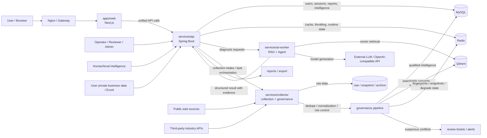
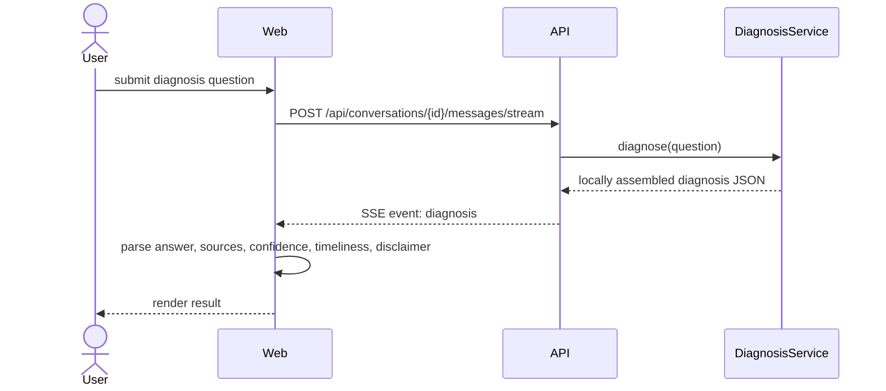
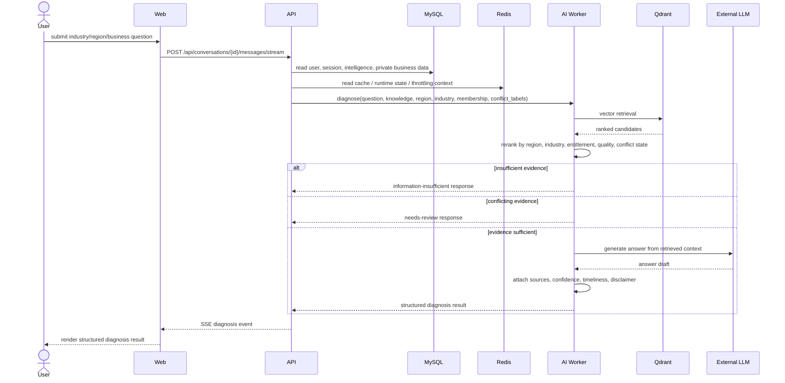
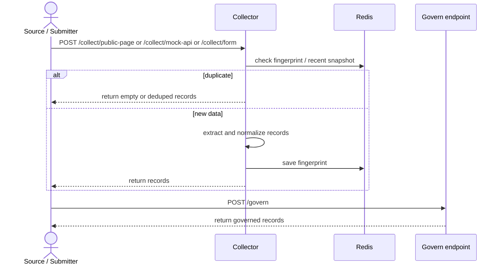
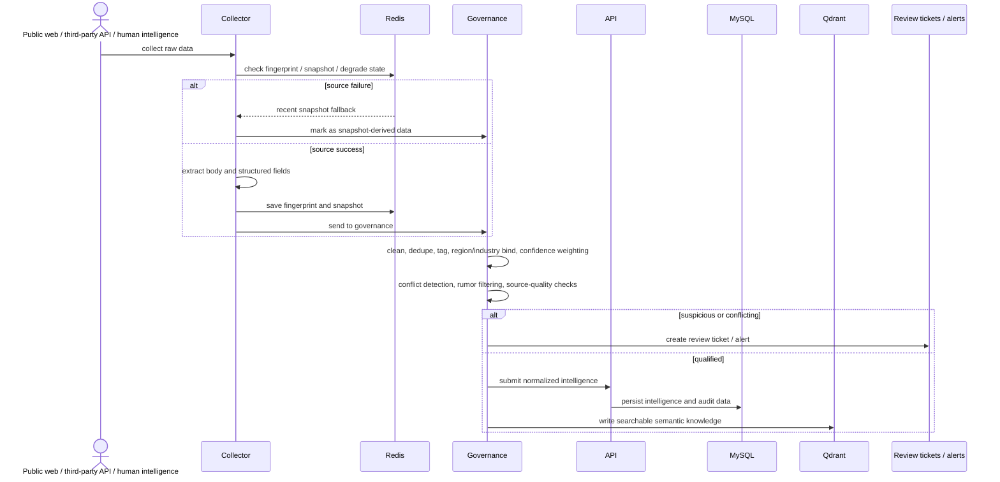

# BizSage Component Interactions and Data Flows

This document is the English counterpart of `component-interactions-and-data-flows-zh-CN.md`. It summarizes how BizSage components exchange data today, how they are intended to exchange data in the target architecture, and where the current implementation still stops short of the planned end-to-end flow.

## 1. Scope and Reading Notes

This document covers two views:

- **Current implementation view**: what the repository code paths clearly support as of `2026-07-05`.
- **Target architecture view**: the intended full data loop described by the governing architecture, implementation, product, and data-collection documents.

The main runtime components are:

- `apps/web` (`Next.js`)
- `services/api` (`Spring Boot`)
- `services/collector` (`FastAPI`)
- `services/ai-worker` (`FastAPI`)
- `infra` (`Docker Compose`, startup scripts, reverse proxy)
- infrastructure dependencies: `MySQL`, `Redis`, and `Qdrant`

## 2. Current Runtime Interaction Map

### 2.1 Mermaid diagram

```mermaid
flowchart LR
    U[User / Browser] --> N[Nginx]
    N --> W[apps/web<br/>Next.js]
    N --> A[services/api<br/>Spring Boot]

    W -->|HTTP / JSON<br/>login, conversations, reports, metrics| A
    W -->|SSE diagnosis stream<br/>/api/conversations/{id}/messages/stream| A

    A -->|JdbcTemplate| M[(MySQL)]
    A -->|Current V1 diagnosis path| D[Local DiagnosisService]

    O[Operator / Admin] -->|intelligence create, review, approve| A
    A -->|intelligence CRUD| M

    S[Public pages / third-party API payloads / form data] --> C[services/collector<br/>FastAPI]
    C -->|fingerprints / recent snapshots| R[(Redis)]
    C -->|records / govern results returned to caller| S

    AI[services/ai-worker<br/>FastAPI] --> Q[(Qdrant)]
    AI --> LLM[Optional external LLM]
```

### 2.2 ASCII diagram

```text
[User / Browser]
      |
      v
   [Nginx]
   /     \
  v       v
[Web] -> [API] -> [MySQL]
  |         |
  |         +--> [Local DiagnosisService]
  |
  +---- Web calls only /api

[Operator / Admin] -> [API] -> [MySQL]

[Public pages / third-party API payloads / form data]
          |
          v
     [Collector] -> [Redis]
          |
          +--> returns collected/governed records to the caller

[AI Worker] -> [Qdrant]
     |
     +-> [Optional external LLM]
```

### 2.3 Current-state interpretation

The codebase clearly supports these live paths:

1. `Web -> API -> MySQL`
2. `Operator/Admin -> API -> MySQL`
3. `Collector -> Redis` for fingerprint deduplication and recent snapshot fallback
4. `AI worker -> Qdrant` for vector-backed retrieval

The following design paths are visible in configuration and governing documents, but are not yet fully closed in the runtime code path shown during this review:

1. `API -> AI worker` as the primary diagnosis path
2. `Collector -> governed intelligence -> API/MySQL/Qdrant` as a fully automated ingestion loop

## 3. Target Architecture Interaction Map

### 3.1 Mermaid diagram



### 3.2 ASCII diagram

```text
                     +----------------------+
                     |   User / Browser     |
                     +----------+-----------+
                                |
                                v
                      +--------------------+
                      |  Nginx / Gateway   |
                      +---------+----------+
                                |
                                v
                      +--------------------+
                      |   Web (Next.js)    |
                      +---------+----------+
                                |
                                v
                      +--------------------+
                      | API (Spring Boot)  |
                      | Unified API layer  |
                      +---+----+----+------+
                          |    |    |
              +-----------+    |    +----------------+
              |                |                     |
              v                v                     v
          [MySQL]          [Redis]          [AI Worker / Agent]
                                                   |
                                                   +------> [Qdrant]
                                                   |
                                                   +------> [External LLM]

External inputs:
[Public web sources] --------\
[Third-party APIs] -----------> [Collector] -> [Governance] -> [MySQL/Qdrant/Redis]
[Human/local intelligence] --/

User business inputs:
[Forms / Excel / session context] -> [API] -> [MySQL/Redis] -> [AI Worker]
```

## 4. Diagnosis Request Sequence

### 4.1 Current implementation sequence



```text
User
 |
 | 1. Ask a diagnosis question
 v
Web
 |
 | 2. POST /messages/stream
 v
API
 |
 | 3. Call local DiagnosisService
 v
DiagnosisService
 |
 | 4. Return diagnosis JSON
 v
API
 |
 | 5. Return SSE event/data
 v
Web
 |
 | 6. Render result
 v
User
```

### 4.2 Target diagnosis sequence



```text
1. User asks a question in Web
2. Web sends the request to API
3. API loads user/session/business/intelligence context
4. API sends a diagnosis request to AI Worker
5. AI Worker retrieves from Qdrant
6. AI Worker reranks by business filters and evidence quality
7. AI Worker returns one of:
   - insufficient evidence
   - needs review
   - evidence-backed diagnosis
8. API streams the final diagnosis result back to Web through SSE
```

## 5. Collection and Ingestion Sequence

### 5.1 Current implementation sequence



```text
Source / Submitter
      |
      | 1. Submit page/API/form payload
      v
   Collector
      |
      | 2. Check Redis fingerprint and snapshot state
      v
     Redis
      |
      | 3. Extract and normalize records
      | 4. Save fingerprint
      v
   Collector
      |
      | 5. Return records
      v
Source / Submitter

Then:
Submitter -> /govern -> governed records returned
```

### 5.2 Target collection and ingestion sequence



```text
1. External data enters Collector
2. Collector checks Redis for dedupe and snapshot fallback
3. Collector extracts and normalizes fields
4. Governance evaluates quality, tags, conflicts, and source weight
5. Suspicious data becomes a review ticket or alert
6. Qualified data is persisted to MySQL and indexed in Qdrant
7. API and AI Worker later consume that stored intelligence
```

## 6. Component-to-Component and Component-to-External Flows

### 6.1 Component-to-component

- `Web -> API`: login, conversations, reports, paid intelligence, ops metrics, diagnosis SSE stream.
- `API -> MySQL`: users, conversations, intelligence, reports, audit-related persistence.
- `API -> AI worker`: intended primary diagnosis and RAG path in the target architecture.
- `Collector -> Redis`: fingerprint deduplication and recent snapshot fallback.
- `AI worker -> Qdrant`: vector search for semantic retrieval.
- `API -> Redis`: target runtime cache, throttling, and state coordination path.

### 6.2 Component-to-external

- `Browser -> Web/API through Nginx`: end-user and operator interaction.
- `Collector -> public web sources / third-party APIs`: compliant external intelligence collection.
- `AI worker -> external LLM`: model generation through an OpenAI-compatible endpoint in the target architecture.
- `Operators/Reviewers -> API`: intelligence entry, review, approval, and operations workflows.
- `User private business data -> API`: guided diagnosis inputs and optional Excel imports in the intended design.

## 7. Current Gaps Between Code and Target Architecture

The current repository already establishes the service boundaries and infrastructure roles, but the following flows are still only partially realized:

1. **Diagnosis execution is still API-local in the visible V1 path.**
   The API currently returns a locally assembled diagnosis payload instead of clearly delegating the main diagnosis path to `services/ai-worker`.

2. **Collection-to-storage automation is incomplete in the visible code path.**
   The collector clearly supports collection, deduplication, snapshot fallback, and governance endpoints, but the reviewed runtime path does not yet show a fully closed automatic ingestion chain into `MySQL` and `Qdrant`.

3. **Target-quality control loops are specified more fully in docs than in runtime wiring.**
   Conflict escalation, review tickets, and complete evidence-weight routing are present at the architectural level but only partly visible in the reviewed code path.

## 8. Recommended Usage

Use this document as the quick-reference map when discussing:

- service boundaries
- what the web app may call directly
- where diagnosis data is supposed to come from
- how collected intelligence should reach storage and later retrieval
- which flows are already implemented versus still planned

## Source Context

This document consolidates the repository inspection performed on `2026-07-05` against:

- `docs/en/product-strategy-and-design.md`
- `docs/en/system-architecture-and-framework.md`
- `docs/en/development-implementation-guide.md`
- `docs/en/data-collection-and-intelligence-perception.md`
- `docs/en/risk-management-and-compliance.md`
- runtime code under `apps/web`, `services/api`, `services/collector`, `services/ai-worker`, and `infra`
