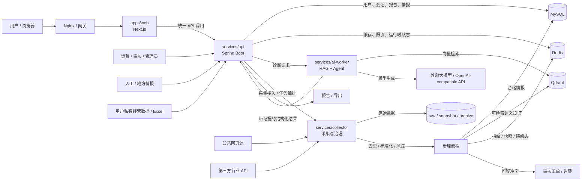
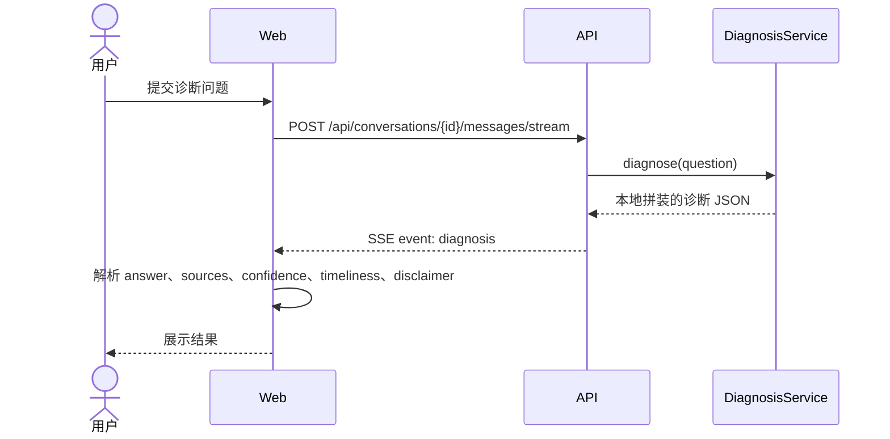
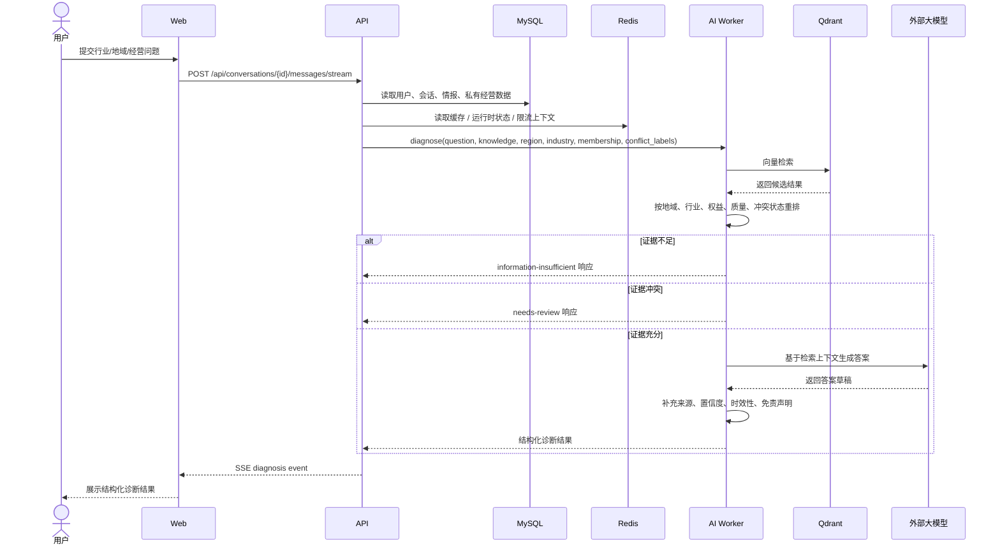
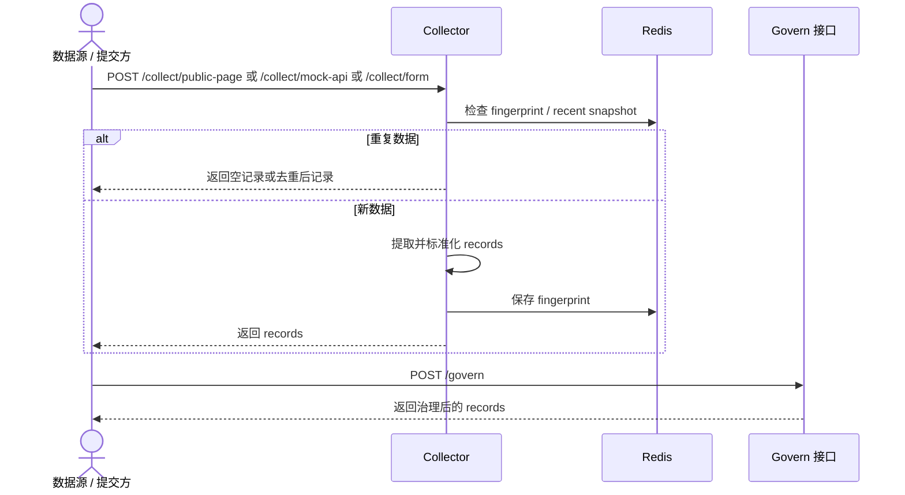
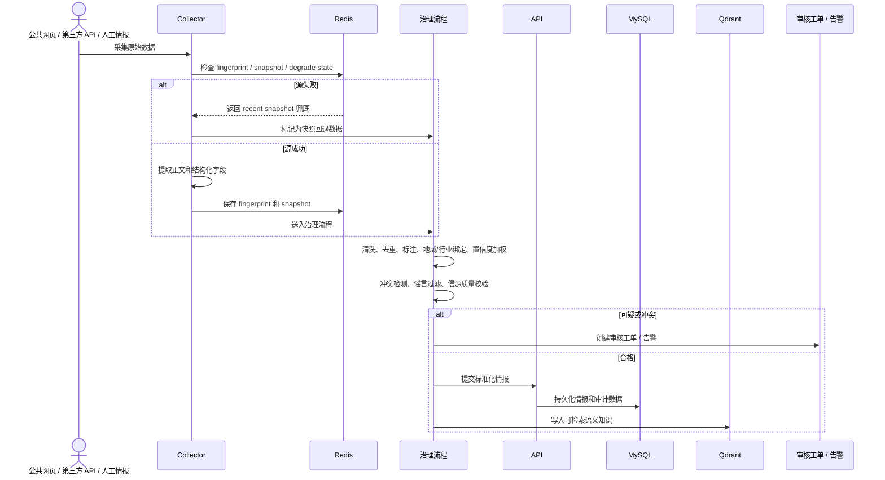

# BizSage 组件交互与数据流

本文是 `component-interactions-and-data-flows.md` 的中文对应版本，用于归档 BizSage 当前代码中的组件交互方式、目标架构中的完整数据流，以及当前实现与目标架构之间尚未完全闭环的部分。

## 1. 范围与阅读说明

本文分为两个视角：

- **当前实现视角**：截至 `2026-07-05`，仓库代码中已经明确落地的交互与数据流。
- **目标架构视角**：治理文档、产品文档、实现文档和采集文档中定义的完整闭环。

本文关注的主要运行时组件包括：

- `apps/web`（`Next.js`）
- `services/api`（`Spring Boot`）
- `services/collector`（`FastAPI`）
- `services/ai-worker`（`FastAPI`）
- `infra`（`Docker Compose`、启动脚本、反向代理）
- 基础设施依赖：`MySQL`、`Redis`、`Qdrant`

## 2. 当前运行时交互图

### 2.1 Mermaid 图

```mermaid
flowchart LR
    U[用户 / 浏览器] --> N[Nginx]
    N --> W[apps/web<br/>Next.js]
    N --> A[services/api<br/>Spring Boot]

    W -->|HTTP / JSON<br/>登录、会话、报告、指标| A
    W -->|SSE 诊断流<br/>/api/conversations/{id}/messages/stream| A

    A -->|JdbcTemplate| M[(MySQL)]
    A -->|当前 V1 诊断路径| D[本地 DiagnosisService]

    O[运营 / 管理员] -->|情报创建、复核、审批| A
    A -->|情报 CRUD| M

    S[公共网页 / 第三方 API 数据 / 表单数据] --> C[services/collector<br/>FastAPI]
    C -->|指纹 / 最近快照| R[(Redis)]
    C -->|将 records / govern 结果返回调用方| S

    AI[services/ai-worker<br/>FastAPI] --> Q[(Qdrant)]
    AI --> LLM[可选外部大模型]
```

### 2.2 ASCII 图

```text
[用户 / 浏览器]
      |
      v
   [Nginx]
   /     \
  v       v
[Web] -> [API] -> [MySQL]
  |         |
  |         +--> [本地 DiagnosisService]
  |
  +---- Web 只调用 /api

[运营 / 管理员] -> [API] -> [MySQL]

[公共网页 / 第三方 API 数据 / 表单数据]
          |
          v
     [Collector] -> [Redis]
          |
          +--> 将采集或治理结果返回调用方

[AI Worker] -> [Qdrant]
     |
     +-> [可选外部大模型]
```

### 2.3 当前状态解读

当前代码里已经能明确确认的实时链路主要有：

1. `Web -> API -> MySQL`
2. `运营/管理员 -> API -> MySQL`
3. `Collector -> Redis`，用于指纹去重和最近快照兜底
4. `AI worker -> Qdrant`，用于向量检索

以下链路在配置和治理文档中都能看到，但在本次审阅到的运行时代码路径里还没有完全闭环：

1. `API -> AI worker` 作为主诊断链路
2. `Collector -> 治理后的情报 -> API/MySQL/Qdrant` 作为自动化入库链路

## 3. 目标架构交互图

### 3.1 Mermaid 图



### 3.2 ASCII 图

```text
                     +----------------------+
                     |   用户 / 浏览器      |
                     +----------+-----------+
                                |
                                v
                      +--------------------+
                      |  Nginx / 网关      |
                      +---------+----------+
                                |
                                v
                      +--------------------+
                      |   Web (Next.js)    |
                      +---------+----------+
                                |
                                v
                      +--------------------+
                      | API (Spring Boot)  |
                      | 统一 API 层        |
                      +---+----+----+------+
                          |    |    |
              +-----------+    |    +----------------+
              |                |                     |
              v                v                     v
          [MySQL]          [Redis]          [AI Worker / Agent]
                                                   |
                                                   +------> [Qdrant]
                                                   |
                                                   +------> [外部大模型]

外部输入：
[公共网页源] ----------\
[第三方行业API] --------> [Collector] -> [治理流程] -> [MySQL/Qdrant/Redis]
[人工/地方情报] -------/

用户业务输入：
[表单 / Excel / 会话上下文] -> [API] -> [MySQL/Redis] -> [AI Worker]
```

## 4. 诊断请求时序图

### 4.1 当前实现版



```text
用户
 |
 | 1. 提交诊断问题
 v
Web
 |
 | 2. POST /messages/stream
 v
API
 |
 | 3. 调用本地 DiagnosisService
 v
DiagnosisService
 |
 | 4. 返回诊断 JSON
 v
API
 |
 | 5. 返回 SSE event/data
 v
Web
 |
 | 6. 渲染结果
 v
用户
```

### 4.2 目标架构版



```text
1. 用户在 Web 提问
2. Web 将请求发给 API
3. API 读取用户、会话、经营和情报上下文
4. API 将诊断请求发给 AI Worker
5. AI Worker 从 Qdrant 检索
6. AI Worker 按业务过滤和证据质量重排
7. AI Worker 返回三类结果之一：
   - 信息不足
   - 需要复核
   - 有证据支撑的诊断结果
8. API 通过 SSE 把最终结果推回 Web
```

## 5. 采集入库时序图

### 5.1 当前实现版



```text
数据源 / 提交方
      |
      | 1. 提交网页/API/表单数据
      v
   Collector
      |
      | 2. 检查 Redis 指纹和快照状态
      v
     Redis
      |
      | 3. 提取并标准化记录
      | 4. 保存指纹
      v
   Collector
      |
      | 5. 返回 records
      v
数据源 / 提交方

然后：
提交方 -> /govern -> 返回治理后的 records
```

### 5.2 目标架构版



```text
1. 外部数据进入 Collector
2. Collector 用 Redis 做去重和快照兜底
3. Collector 抽取并标准化字段
4. 治理流程评估质量、标签、冲突和信源权重
5. 可疑数据转为审核工单或告警
6. 合格数据写入 MySQL，并进入 Qdrant 检索层
7. 后续 API 和 AI Worker 从这些存储中消费情报
```

## 6. 组件间数据流与组件对外交互

### 6.1 组件之间

- `Web -> API`：登录、会话、报告、付费情报、运维指标、诊断 SSE。
- `API -> MySQL`：用户、会话、情报、报告和审计相关持久化。
- `API -> AI worker`：目标架构中的主诊断和 RAG 路径。
- `Collector -> Redis`：指纹去重和最近快照兜底。
- `AI worker -> Qdrant`：向量语义检索。
- `API -> Redis`：目标架构中的缓存、限流和运行时状态协调。

### 6.2 组件与外界

- `浏览器 -> Web/API（经 Nginx）`：终端用户和运营人员的统一访问入口。
- `Collector -> 公共网页 / 第三方 API`：合规外部情报采集。
- `AI worker -> 外部大模型`：目标架构中的模型生成调用。
- `运营/审核人员 -> API`：情报录入、复核、审批和运维流程。
- `用户私有经营数据 -> API`：目标设计中的引导式诊断数据和 Excel 导入。

## 7. 当前实现与目标架构的差距

当前仓库已经把服务边界和基础设施角色搭好了，但以下链路仍然只部分实现：

1. **诊断执行在可见的 V1 路径中仍主要停留在 API 本地。**
   当前 API 会直接返回本地拼装的诊断结果，而不是明确把主诊断链路委托给 `services/ai-worker`。

2. **采集到存储的自动闭环还不完整。**
   Collector 已具备采集、去重、快照兜底和治理接口，但本次审阅到的运行时代码路径还没有清晰展示自动写入 `MySQL` 与 `Qdrant` 的完整主链路。

3. **目标架构中的质量控制闭环比当前运行时接线更完整。**
   冲突升级、审核工单、完整证据权重等能力在治理文档里定义得更充分，但在当前代码路径里只部分可见。

## 8. 推荐用途

这份文档适合作为以下讨论的快速参考：

- 服务边界
- Web 允许直接调用哪些服务
- 诊断结果理论上应从哪里产生
- 外部情报如何进入存储并参与后续检索
- 哪些链路已经实装，哪些仍属于规划目标

## 来源说明

本文基于 `2026-07-05` 对以下材料和代码的联合审阅整理而成：

- `docs/en/product-strategy-and-design.md`
- `docs/en/system-architecture-and-framework.md`
- `docs/en/development-implementation-guide.md`
- `docs/en/data-collection-and-intelligence-perception.md`
- `docs/en/risk-management-and-compliance.md`
- `apps/web`、`services/api`、`services/collector`、`services/ai-worker` 和 `infra` 下的运行时代码
