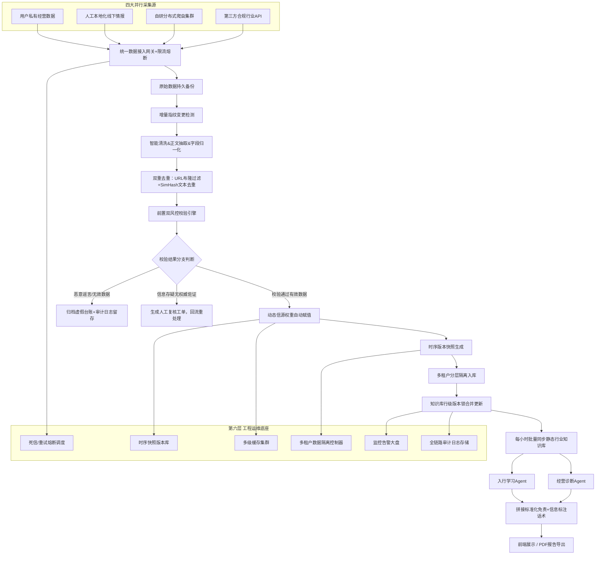
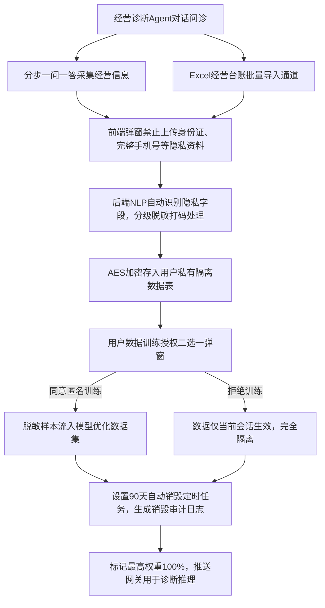
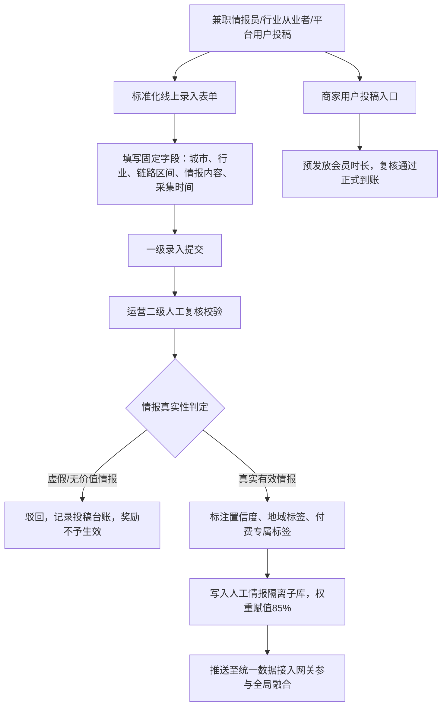
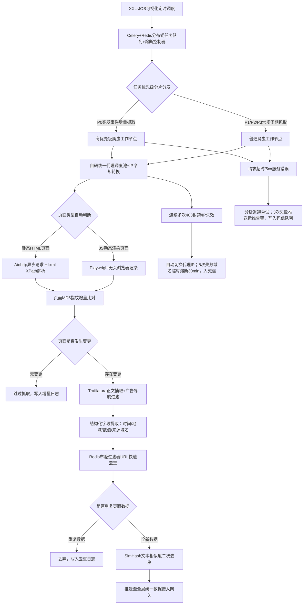
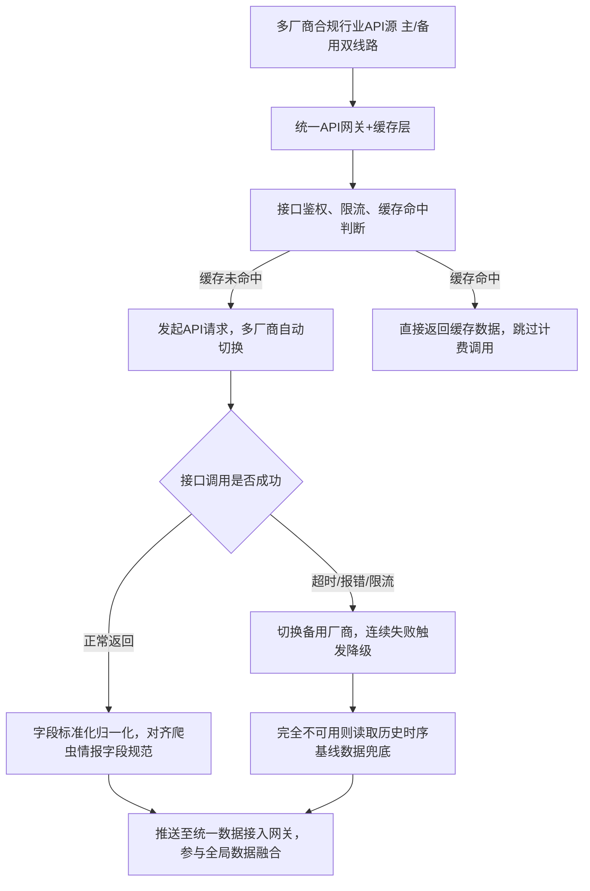
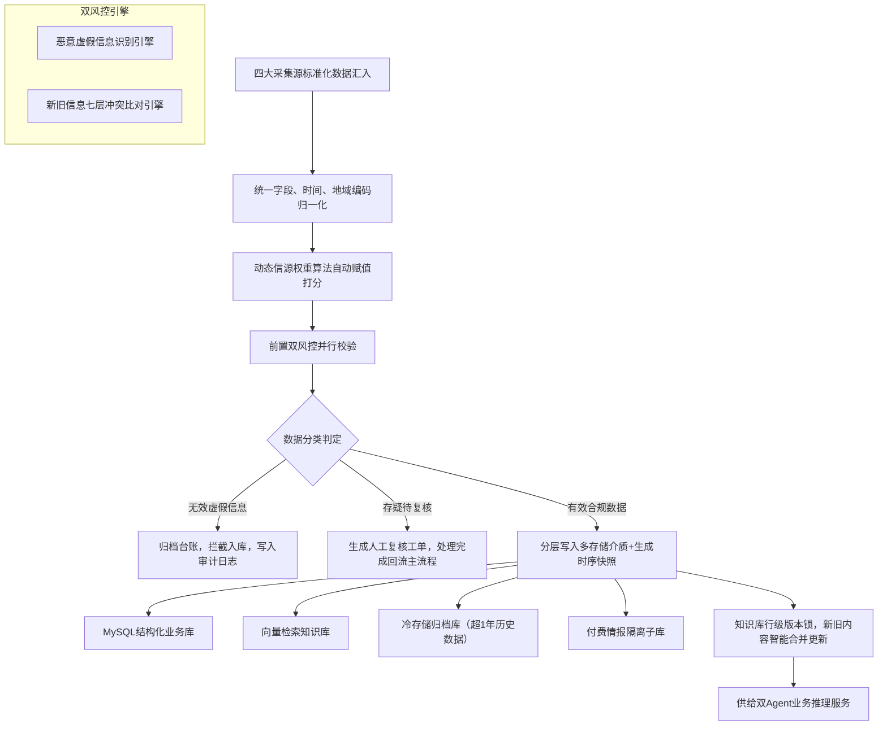

# BizSage 数据采集系统与情报感知引擎

## 目录

- [第一部分：数据采集系统架构](#第一部分数据采集系统架构)
  - [1.1 六层闭环架构总览](#11-六层闭环架构总览)
  - [1.2 六维信源权重体系](#12-六维信源权重体系)
  - [1.3 4 类数据源详细设计](#13-4-类数据源详细设计)
  - [1.4 自研爬虫集群架构](#14-自研爬虫集群架构)
  - [1.5 第三方 API 采集模块](#15-第三方-api-采集模块)
  - [1.6 人工情报采集模块](#16-人工情报采集模块)
  - [1.7 全局数据治理体系](#17-全局数据治理体系)
- [第二部分：数据基础设施](#第二部分数据基础设施)
  - [2.1 4 层缓存架构](#21-4-层缓存架构)
  - [2.2 多租户四层数据隔离](#22-多租户四层数据隔离)
  - [2.3 监控告警体系](#23-监控告警体系)
  - [2.4 全链路合规审计日志](#24-全链路合规审计日志)
- [第三部分：全网情报感知引擎](#第三部分全网情报感知引擎)
  - [3.1 7 层架构详细设计](#31-7-层架构详细设计)
  - [3.2 情报采集策略](#32-情报采集策略)
  - [3.3 情报处理流水线](#33-情报处理流水线)
  - [3.4 情报分级与分发](#34-情报分级与分发)
  - [3.5 恶意虚假信息识别与拦截](#35-恶意虚假信息识别与拦截)
- [第四部分：分阶段实施组合方案](#第四部分分阶段实施组合方案)
  - [4.1 5 大数据采集场景全方案枚举](#41-5-大数据采集场景全方案枚举)
  - [4.2 MVP 阶段推荐组合（P0）](#42-mvp-阶段推荐组合p0)
  - [4.3 增长阶段推荐组合（P1）](#43-增长阶段推荐组合p1)
  - [4.4 成熟阶段推荐组合（P2）](#44-成熟阶段推荐组合p2)
- [附录：数据字段字典与工具选型对比](#附录数据字段字典与工具选型对比)

---

# 第一部分：数据采集系统架构

## 1.1 六层闭环架构总览

系统采用六层分层混合采集架构，以自研分布式爬虫为主、第三方 API 为辅、人工线下情报补盲、用户私有数据置顶，配套完整工程运维底座：

| 层级 | 名称 | 定位 |
|------|------|------|
| 第一层 | 用户私有经营数据层 | 最高推理权重，经营诊断核心依据 |
| 第二层 | 人工本地化线下情报层 | 独家差异化壁垒数据 |
| 第三层 | 自研分布式合规爬虫集群 | 全网公开核心数据源 |
| 第四层 | 第三方合规行业 API 补充层 | 标准化行情、宏观统计数据 |
| 第五层 | 风控归一化 & 数据治理层 | 统一清洗、去重、校验、多源融合 |
| 第六层 | 工程运维底座层 | 分级重试/熔断降级/死信队列、多级缓存、监控告警、弹性伸缩、多租户隔离、时序快照、审计日志、动态权重、并发锁 |

**完整数据流闭环：**

多源采集 → 流量限流/熔断保护 → 统一任务调度 → 原始数据持久备份 → 增量指纹变更检测 → 智能清洗 & 正文抽取 & 字段归一化 → 双重去重过滤 → 前置双风控校验引擎 → 动态信源权重自动赋值 → 时序版本快照生成 → 多级缓存写入 → 多租户分层隔离入库 → 知识库版本锁合并更新 → 监控指标实时上报 → 全链路操作日志持久留存 → 同步行业知识库 → 双 Agent 业务推理调用 → 拼接标准化免责标注话术输出



## 1.2 六维信源权重体系

系统对数据源实施分级权重管理，基础权重固定，动态算法微调：

| 优先级 | 数据源类型 | 基础权重 | 说明 |
|--------|-----------|---------|------|
| 1 | 用户一手经营数据 | 100% | 经营诊断核心依据 |
| 2 | 本地人工扫盲情报/付费圈层情报 | 85% | 独家差异化壁垒数据 |
| 3 | S/A 级权威爬虫情报 | 60% | 政务、权威行业平台 |
| 4 | B 级行业资讯 | 35% | 行业媒体、一般资讯 |
| 5 | C/D 级自媒体资讯 | 10% | 仅归档，不参与风险/机遇研判 |
| 6 | 静态行业知识库基线 | 兜底基准 | 无动态情报时的基线数据 |

**动态信源权重算法（V2.0 新增）：**

系统自动实时计算调整，打分维度包括：

1. 历史情报人工复核通过率
2. 历史冲突、谣言产生频次
3. 信息更新时效性、数据新鲜度
4. 长期信息准确率、与行业基线匹配度
5. 信源合规等级

自动升降权机制：低质量来源权重持续下调，权威可靠来源权重上浮。

## 1.3 4 类数据源详细设计

### 1.3.1 用户私有经营数据采集（权重 100%）

**能力特点：**

- 最高推理权重，经营诊断核心依据
- 对话式分步采集、Excel 表单批量导入双渠道
- 后端自动识别隐私信息脱敏、AES 加密隔离存储
- 90 天自动销毁机制，用户数据训练授权双选项
- 无外部第三方依赖，数据完全私有闭环

**适配场景：**

- 经营诊断 Agent 八维经营诊断
- 用户个性化经营短板归因、利润量化测算
- 本地市场经营对标、定制化整改方案输出



**字段级隐私脱敏强制规范：**

| 脱敏等级 | 包含字段 | 处理方式 |
|----------|---------|---------|
| 不可逆脱敏（原始明文禁止入库，永久不可还原） | 手机号、微信、QQ、身份证号、完整居住地址、法人真实姓名 | 永久不可还原 |
| 可逆脱敏（后台管理员授权可见，前端全隐藏） | 营业执照编号、门店统一社会信用代码、供应商完整联系方式 | 管理员授权可查看 |
| 禁止上传/入库清单 | 证件照片、人脸影像、银行卡完整卡号、对公账户私密信息 | 前端拦截，拒绝上传 |

**数据生命周期完整约束：**

采集 → 前端隐私拦截 → 后端自动脱敏 → AES 加密隔离存储 → 90 天定时自动销毁 → 销毁操作日志留存归档

### 1.3.2 人工本地化情报采集（权重 85%）

**能力特点：**

- 覆盖爬虫无法获取的线下口头政策、区县商圈、行业圈层信息
- 录入 + 运营双人复核机制，人工标注置信度分值
- 地域数据强隔离，仅对对应城市用户优先展示
- 区分免费公开情报、付费圈层情报，权限隔离
- 竞品无法复刻，核心商业化差异化壁垒

**适配场景：**

- 区县级小众市场规则、线下临时管控、本地潜规则
- 批发市场实时行情、门店口头扶持政策
- 付费会员专属高阶行业情报供给



### 1.3.3 自研合规爬虫集群（权重 60%）

详见 1.4 节详细架构设计。

### 1.3.4 第三方合规 API 采集

**能力特点：**

- 输出结构化标准化数据，无需复杂清洗解析
- 官方合规数据源，规避爬虫抓取付费平台带来的版权侵权风险
- 数据自带量化指标，可直接用于行业量化研判模型

**适配场景：**

- 大宗商品报价、全国物流运价、周期性行情波动
- 海关进出口、宏观经济、行业大盘统计数据
- 禁止爬虫抓取的付费商业统计、行业大盘数据

## 1.4 自研爬虫集群架构（6 层：调度/工作节点/代理池/清洗/去重/风控）

### 爬虫六层自研分层基础架构

| 层级 | 组件 | 职责 |
|------|------|------|
| 调度控制层 | Celery + Redis + XXL-JOB | 分布式任务调度、优先级分片、可视化定时配置 |
| 分布式工作节点层 | Aiohttp 异步集群 + Playwright 动态渲染兜底 | 高并发页面抓取 |
| 智能代理池管理层 | 自研多厂商统一代理调度服务 | IP 存活检测、分层分配、地域定向筛选 |
| 正文抽取清洗层 | Trafilatura + 自研广告/垃圾内容过滤规则引擎 | 正文提取、广告导航过滤 |
| 去重归一化层 | Redis 布隆过滤器 URL 去重 + SimHash 文本相似度二次去重 | 多级去重 |
| 前置风控校验层 | 恶意谣言识别引擎 + 新旧信息七层冲突比对算法 | 数据真实性校验 |

### V2.0 新增生产级核心能力

**增量抓取变更检测机制：**

1. 页面整体 MD5 资源指纹比对，识别页面结构改动
2. 正文 SimHash 相似度校验，仅抓取内容发生变更的页面
3. 无变更任务直接跳过，大幅节约代理 IP 消耗、服务器算力
4. 区分全量同步任务、增量更新任务，低峰期执行全量同步

**分级重试 + 指数退避策略：**

| 异常类型 | 重试策略 | 上限 |
|----------|---------|------|
| 网络抖动、连接超时 | 间隔 1s/3s/5s | 重试 3 次 |
| 5xx 服务器内部错误 | 指数退避 10s/30s/60s | 最多重试 3 轮 |
| 403 封禁、验证码拦截 | 禁止重试，IP 进入冷却轮换池 | 不重复尝试 |
| 页面结构解析失败 | 标记站点异常，推送运维告警 | 不重复抓取 |

**熔断降级集群保护机制：**

1. 单域名抓取失败率 > 20%，自动熔断 30 分钟，暂停分发该域名任务
2. Redis 任务队列堆积量超过阈值，自动暂停 P3/P4 低优先级抓取任务
3. 代理池整体 IP 可用率低于 60%，自动切换备用代理厂商，限流抓取频次

**死信队列全生命周期管理：**

1. 永久抓取失败任务统一写入死信库，自动分类标签：站点改版、域名失效、长期封禁、规则匹配异常
2. 每周定时生成死信复盘报表，运维统一清理无效域名、优化解析规则
3. 死信数据留存 30 天，支持回溯排查站点反爬、页面改版问题

**爬虫独立架构流程图（含容错、增量、死信分支）：**



**自研爬虫独有能力：**

1. 按站点等级差异化合规限速、并发控制、正文截取字数管控，满足著作权合理引用
2. 突发事件触发动态升频跟踪抓取机制
3. 抓取源头自动绑定行业 ID、链路节点 ID、地域标签、信源权重等级
4. 抓取清洗完成后原生联动谣言拦截、新旧信息冲突校验双风控引擎
5. 与本项目知识库、双 Agent 推理、报告生成体系深度耦合，无中间数据转换损耗
6. 抓取信源数据质量自动上报，参与动态权重打分模型

## 1.5 第三方 API 采集模块（高可用设计）

**V2.0 新增 API 高可用强制规范：**

1. 同类型行情/统计 API 必须配置 2~3 家厂商作为冗余备用
2. 统一 Redis 缓存机制：行情数据缓存 5~30 分钟，减少计费调用次数、规避平台限流
3. 自动故障切换逻辑：单厂商连续失败 5 次，自动切至备用服务商
4. 全链路降级兜底：所有 API 厂商全部不可用时，读取近期时序快照数据填充，保证业务不中断
5. API 调用日志完整留存，统计调用量、失败率、扣费明细，用于成本管控

**基础适配规范：**

1. 仅采购公开可商用、具备合规授权、无版权风险的数据源
2. 所有 API 返回数据统一标准化字段结构，和爬虫情报字段完全对齐
3. 付费行情、付费研报类平台禁止爬虫抓取，统一通过官方 API 采购，规避侵权风险



## 1.6 人工情报采集模块（双人复核+投稿激励）

**核心能力：**

1. 补齐机器采集盲区：线下口头政策、本地商圈行情、行业圈层潜规则
2. 双人录入复核机制，保障情报真实性
3. 付费/免费情报数据存储隔离，作为付费会员核心增值权益

详细流程已在 1.3.2 节以 Mermaid 流程图展示，此处补充人工采集三元采集方案：

| 方案 | 说明 | 优势 | 劣势 |
|------|------|------|------|
| 本地兼职情报员线下扫盲 | 按省市划分兼职采集人员，走访批发市场、产业园区、本地门店 | 独家线下数据壁垒，竞品无法复刻 | 持续人力运营成本 |
| 行业协会/本地商家社群供稿合作 | 与各地行业协会、本地商户社群群主合作，定期同步信息 | 数据来源权威，可信度高 | 合作谈判周期长，覆盖扩张慢 |
| 用户投稿激励机制 | 面向平台本地商家开放情报投稿入口，奖励会员时长 | 低成本增量补充 | 信息质量参差不齐，复核工作量大 |

## 1.7 全局数据治理体系（动态权重+时序快照+乐观锁）



### 时序版本快照体系

| 快照类型 | 频次 | 用途 |
|----------|------|------|
| 日快照 | 每日 | 短期行情对比 |
| 周快照 | 每周 | 行业动态追踪 |
| 月快照 | 每月 | 月度经营分析 |
| 季度行业基线快照 | 每季度 | 行业基线基准，长期趋势研判 |

存储位置：冷存储时序快照库，永久归档不删除。

业务用途：行业行情同比环比、政策迭代溯源、经营数据历史对比、知识库版本回溯复盘。

### 知识库并发锁合并机制

解决多源情报同时更新同一产业链知识点导致覆盖错乱问题：

1. 采用数据库行级乐观锁 + 版本号控制并发写入
2. 多源冲突内容不直接覆盖旧数据，自动拆分、分类合并，区分长期规则/短期波动/区域特例
3. 无法自动合并的冲突内容标记人工复核工单，运营统一处理后入库

---

# 第二部分：数据基础设施

## 2.1 4 层缓存架构（L1-L4 + 4 种 TTL 策略）

### 四层缓存分层设计

| 层级 | 缓存对象 | 作用 |
|------|---------|------|
| L1 | 爬虫页面缓存 | 缓存已抓取静态页面，减少重复抓取，降低代理 IP 消耗 |
| L2 | API 结果缓存 | 行情、统计类 API 返回数据缓存，减少付费调用，规避第三方限流 |
| L3 | 行业知识库全局缓存 | 全行业基础链路、指标规则缓存，大幅降低 Agent 查询响应耗时 |
| L4 | 维度局部缓存 | 按城市、行业分区缓存本地情报，隔离多用户查询压力 |

### 四种缓存时效策略

| 策略 | 缓存对象 | TTL |
|------|---------|-----|
| 永久缓存 | 静态行业基线规则 | 永久，每日凌晨定时刷新 |
| 短时缓存 | 大宗商品、物流行情 | 5~30 分钟 |
| 临时热点缓存 | 突发政策、临时管控热点资讯 | 2 小时 |
| 会话本地缓存 | 用户私有经营数据 | 仅当前会话，不全局共享 |

## 2.2 多租户四层数据隔离

| 隔离层级 | 隔离内容 | 实现方式 |
|----------|---------|---------|
| 用户私有数据隔离 | 个人经营加密数据表 | 独立隔离，任何其他用户/管理员无权限读取明文 |
| 地域数据隔离 | 本地情报 | 用户仅可查询注册所属省/市/区县本地情报，跨地域数据自动过滤屏蔽 |
| 行业数据隔离 | 跨行业情报 | 跨行业情报访问拦截，避免无关数据干扰诊断推理 |
| 会员等级权限隔离 | 付费情报 | 免费用户、普通付费会员、高阶付费会员分库存储，高阶圈层情报仅高等会员可见 |

## 2.3 监控告警体系（5 类指标+三级分级告警）

### 核心监控指标大盘全覆盖

| 指标类别 | 监控项 |
|----------|--------|
| 爬虫指标 | 抓取成功率、失败率、IP 可用率、IP 封禁数量、任务队列堆积量 |
| 数据处理指标 | 清洗失败率、去重过滤量、风控谣言拦截量、情报日新增总量 |
| API 指标 | 调用成功率、厂商切换次数、计费调用总量、缓存命中率 |
| 质量指标 | 各信源动态权重均值、冲突情报数量、人工复核工单积压量 |
| 集群资源指标 | CPU、内存、磁盘、Redis 内存、数据库连接数 |

### 三级分级告警推送机制（企业微信 + 短信双通道）

| 级别 | 响应要求 | 触发条件 |
|------|---------|---------|
| 紧急告警 | 即时处理 | 集群节点宕机、核心政务源抓取中断、代理 IP 大面积封禁、数据库连接耗尽 |
| 重要告警 | 当日处理 | 任务队列严重堆积、API 多厂商同时故障、信源整体质量暴跌 |
| 普通告警 | 定时复盘 | 少量站点抓取失败、低优先级任务延迟、少量待复核工单积压 |

### 集群弹性伸缩机制

1. 扩容触发：爬虫任务队列堆积超过阈值，自动新增爬虫工作节点
2. 缩容触发：夜间低峰时段、任务量极低，自动下线闲置节点节约服务器成本
3. 故障节点自愈：定时健康检查，异常节点自动剔除、重启重建

## 2.4 全链路合规审计日志（8 类日志）

所有操作日志统一存储不少于 6 个月，每条日志携带唯一操作流水号，全程可溯源：

| 序号 | 日志类别 | 记录内容 |
|------|---------|---------|
| 1 | 爬虫全量抓取日志 | 域名、抓取时间、使用 IP、页面结果、是否触发熔断/重试 |
| 2 | 数据清洗/去重/过滤执行日志 | 处理过程记录 |
| 3 | 风控拦截/放行/冲突判定操作日志 | 风控判定结果 |
| 4 | 人工情报录入/复核/驳回操作日志 | 人工操作全程记录 |
| 5 | 知识库修改/快照生成/版本合并日志 | 知识库变更记录 |
| 6 | 用户经营数据采集/脱敏/访问/自动销毁日志 | 用户数据全生命周期记录 |
| 7 | 后台管理员登录/数据查看/配置修改操作日志 | 管理操作记录 |
| 8 | 第三方 API 调用/厂商切换/缓存命中/未命中日志 | API 调用记录 |

---

# 第三部分：全网情报感知引擎

## 3.1 7 层架构详细设计

情报引擎作为方向 3 新增后台核心模块，实现 7×24 小时主动全网检索、行业自动研判、风险/机遇自动标记，数据回流至前端双 Agent 共用知识库。

### 三大业务模块协同关系

1. **前端应用层**：双模式对话 Agent（模式 1 入行认知、模式 2 经营诊断）
2. **核心业务后台层**：行业知识库管理、行业模板配置、用户对话会话管理、报告生成服务
3. **情报感知引擎层**（方向 3 新增）：全网主动检索 + 行业智能研判系统

三层数据互通，情报引擎产出动态行业数据，实时同步至公共知识库，前端两个 Agent 读取动态情报做引导、诊断、建议输出。

### 情报引擎核心业务目标

1. **政策感知**：产业政策、地方扶持/监管新规、环保、税收、资质准入、行业整顿通知
2. **市场热度感知**：赛道流量热度、消费趋势、线上 GMV 增速、门店扩张/闭店潮
3. **产业链路变动感知**：上游原料涨跌、工厂产能调整、物流运价波动、代工产能收缩/扩张
4. **成本波动感知**：原材料、人工、仓储、物流、平台推广费、渠道扣点实时变动
5. 自动区分两类标签：行业机遇信息、行业风险信息，分级加权存储
6. 定时增量更新，自动关联对应行业、对应产业链路节点，前端 Agent 可精准调取对应节点最新动态情报

### 系统核心设计原则

1. 底层数据完全复用：情报产出与原有链路库、指标库、行规库打通，不独立隔离
2. 主动触发优先，被动检索为辅：定时全量巡检 + 事件触发增量抓取
3. 行业自动归类：无需人工打标，NLP 自动匹配行业、匹配七大链路节点
4. 分级研判机制：区分短期波动、中长期趋势、致命风险、长期红利
5. 权限隔离：后台管理员可配置抓取范围、风险阈值、推送规则；前端用户仅可见与自身行业匹配的情报摘要
6. 可回溯溯源：每条情报保留原始链接、发布时间、来源权重、置信度评分

### 7 层分层架构总览

| 分层 | 名称 | 职责 |
|------|------|------|
| 分层 1 | 多源数据采集调度层 | 爬虫/API 拉取集群 |
| 分层 2 | 原始数据清洗与标准化层 | 清洗、去重、格式统一 |
| 分层 3 | NLP 行业语义解析与链路关联层 | 行业匹配、链路节点绑定 |
| 分层 4 | 机遇 & 风险智能研判模型层 | 核心算法层，二元标签+四级严重度 |
| 分层 5 | 情报数据存储与公共知识库同步层 | 双存储架构+自动同步 |
| 分层 6 | 后台管理配置、告警、人工复核层 | 管理员操作界面 |
| 分层 7 | 对外 API 输出层 | 供给前端双 Agent 调用 |

## 3.2 情报采集策略

### 全数据源分类

**（1）政府政策类数据源（高权重，置信度最高）**

- 国家级：发改委、工信部、商务部、生态环境部、税务总局、市场监管总局官网公告、政策文件
- 省级/市级：地方政务网、经信局、商务局、文旅局、市场监管局通知
- 行业专项监管：食药监局、应急管理、住建、交通、海关总署进出口政策
- 政府采购平台、招投标政策、产业扶持补贴公示

**（2）供应链 & 成本类数据源**

- 大宗商品交易平台：钢材、化工、粮油、有色金属实时报价
- 农产品产地批发平台、农资报价网站
- 物流干线运价平台、冷链报价、快递调价公告
- 设备厂商产能公告、工厂停产/扩产公示、代工行业产能调研
- 进出口报关数据、海关进出口量统计、关税调整通知

**（3）市场热度 & 消费渠道数据源**

- 电商平台行业报告、类目 GMV 增速、热销品类、类目准入新规
- 短视频本地生活平台规则变更、佣金调整、流量扶持赛道
- 行业研报、第三方消费数据机构、线下门店扩张/闭店新闻
- 社交媒体、行业论坛、产业社群舆情（消费偏好、投诉集中问题）

**（4）行业舆情 & 竞争动态数据源**

- 行业媒体垂直资讯、产业新闻
- 头部企业财报、扩产、降价、渠道调整公告
- 行业安全事故、质量曝光、集体投诉、行业整顿新闻
- 跨区域产业转移、产业园区招商政策

### 抓取调度策略

**定时全量巡检任务：**

| 数据类型 | 抓取频次 |
|----------|---------|
| 政策类 | 每日 0 点、12 点两轮全站点扫描 |
| 大宗商品/物流成本 | 每 4 小时增量抓取 |
| 市场热度、行业资讯 | 每日早 8 点、晚 18 点抓取 |

**关键词增量触发抓取（主动检索核心）：**

后台为每个行业配置专属关键词词库，分为 4 类：

| 关键词类别 | 示例 |
|-----------|------|
| 政策关键词 | 扶持、补贴、限产、整治、禁售、税收减免、资质新规 |
| 成本关键词 | 涨价、降价、原料紧缺、运费上调、人工成本上涨 |
| 链路变动关键词 | 扩产、停产、产能收缩、代工转移、供应链外迁 |
| 热度关键词 | 爆发、热销、闭店潮、流量倾斜、平台新规 |

系统定时检索全网含行业 + 关键词的新页面，增量入库。

**事件重抓取机制：**

当识别到高置信度重大事件（行业整顿、原料暴涨、补贴落地），自动提升抓取频率至 1 小时一次，持续 7 天跟踪后续连锁新闻。

**抓取优先级权重：**

官方政务网站 > 权威行业平台 > 头部企业官方公告 > 第三方数据机构 > 自媒体资讯 > 社群舆情

### 采集模块后台配置项（管理员可视化配置）

1. 新增/停用数据源站点
2. 自定义行业关键词词库增删
3. 调整各类数据源抓取周期
4. 配置抓取并发上限、反爬延迟、代理池切换规则
5. 设置黑名单域名（低质量营销软文过滤）
6. 配置地域抓取范围（可限定单一省市情报采集，适配本地经营诊断）

## 3.3 情报处理流水线

### 第二层：原始数据清洗与标准化层

**清洗处理流程：**

1. 去重：URL 指纹、内容相似度去重，避免重复情报入库
2. 垃圾过滤：广告、营销软文、无关行业内容、重复水帖直接丢弃
3. 文本提取：去除网页导航、弹窗、广告，仅保留正文、标题、发布时间
4. 格式统一：统一时间戳、来源名称、原文链接、地域标签（全国/省/市）
5. 数值提取：自动抽取价格、涨幅、产能、补贴金额、税率、增速等量化数字，存入结构化字段

**标准化输出字段（单条情报基础表结构）：**

```
情报ID、行业ID、子行业分类、来源类型、来源名称、原文URL、
发布时间、抓取时间、地域标签、原始标题、正文摘要、提取数值集合、
置信度分数、原始权重标签
```

### 第三层：NLP 语义解析与产业链路关联模块（核心联动层）

作用：将清洗后的情报自动绑定对应行业、绑定七大链路节点，实现前端 Agent 可按链路筛选情报。

**三步语义识别流程：**

1. **行业匹配**：行业实体识别，自动归属至后台已录入行业分类
2. **链路节点匹配**：通过关键词匹配七大固定链路：
   - 原材料端 / 生产制造端 / 品控质检端 / 仓储库存端 / 物流运输端 / 渠道运营端 / 销售回款端
   - 支持单情报匹配多个链路区间（如原料涨价同时影响生产、渠道、销售）
3. **事件类型识别**：自动打标签，可选标签池：
   - 政策扶持、监管收紧、原料涨价、原料降价、产能扩张、产能收缩、物流成本上涨
   - 渠道规则变更、市场热度提升、市场热度下滑、税收优惠、行业事故、补贴落地、区域产业转移

**结构化新增关联字段：**

```
绑定行业ID列表、绑定链路节点列表、事件类型标签、涉及地域范围、
量化变动值（如涨幅15%）、影响周期标签（短期<3月/中期3-12月/长期>1年）
```

## 3.4 情报分级与分发（四级严重度+5 个对外 API）

### 第四层：机遇 & 风险智能研判模型层（核心算法模块）

输入：经过 NLP 关联后的标准化情报数据
输出：每条情报生成二元标签【机遇/风险】+ 四级严重度评分 + 行业影响范围测算

**一、机遇判定规则（满足任意多条自动标记机遇）**

| 类别 | 判定条件 |
|------|---------|
| 政策类 | 税收减免、专项补贴、产业扶持、低息贷款、准入放宽、园区优惠 |
| 成本类 | 核心原料降价、物流运价下调、人工补贴、平台佣金下调 |
| 产能渠道类 | 上游扩产供货充足、平台流量倾斜、新渠道开放、消费需求上涨 |
| 区域类 | 本地产业招商、商圈扶持、文旅消费刺激政策 |

**二、风险判定规则（满足任意多条自动标记风险）**

| 类别 | 判定条件 |
|------|---------|
| 政策监管 | 行业整治、限产停产、资质收紧、禁售、环保严查、税收上调 |
| 成本风险 | 原料大幅涨价、物流涨价、平台扣点提升、人工成本上涨 |
| 供应链风险 | 上游产能收缩、原料断供、进口关税提升、产地减产 |
| 市场风险 | 行业饱和、闭店潮、消费下滑、竞品低价内卷、平台规则打压 |
| 合规风险 | 大规模质量曝光、行业安全事故、高额处罚新规 |

**三、四级严重度分级（后台可调整阈值）**

| 级别 | 名称 | 描述 |
|------|------|------|
| 1 级 | 观察级 | 轻微短期波动，无实质影响 |
| 2 级 | 中优/中性风险 | 小幅成本波动、短期区域政策，可小幅优化经营 |
| 3 级 | 高优机遇/重要风险 | 全行业政策红利、原料大幅涨跌、渠道重大调整，必须纳入经营调整 |
| 4 级 | 致命级红利/致命级风险 | 长期产业扶持政策、全行业停产整顿、原料暴涨 30% 以上、全域监管严查，直接改变行业生存逻辑 |

**四、联动推演计算（对接前端 Agent 链路推理）**

模型自动生成传导文本，存入情报字段，供给 Agent 直接调用：

示例：
> 情报：钢材原料涨价 20%（风险 4 级，绑定原材料链路）
> 自动推演传导：上游原料成本上涨 → 生产制造成本提升 → 出厂价被迫上调 → 渠道利润压缩 → 终端销量下滑，回款周期拉长。

### 第五层：情报数据存储与公共知识库同步层

**双存储架构：**

1. **结构化数据库（MySQL）**：存储标准化情报标签、关联行业、链路、分级、推演结论，供业务查询
2. **向量数据库**：存储情报正文向量，支持 Agent 语义检索（用户提问"今年建材有什么政策风险"，向量匹配相关情报）

**自动同步公共知识库机制：**

1. 定时同步：每小时将新增研判情报批量写入行业公共知识库
2. 链路节点挂载：每条情报挂载至对应七大链路节点详情页
3. 情报生命周期管理：
   - 短期情报（3 个月内失效）：自动标记过期，前端弱化展示
   - 中长期政策/产业趋势：长期置顶展示
   - 历史情报永久归档，支持后台回溯查询历年行业变化

**与原有知识库融合逻辑：**

- 模式 1（入行学习 Agent）：行业总览、链路节点详情自动展示"最新行业机遇/风险情报"，辅助新手认知当前行业环境
- 模式 2（经营诊断 Agent）：在地域诊断、供应链诊断、渠道诊断环节，自动拉取用户所在城市对应行业最新情报，用于定位经营困境外部诱因
  - 示例：商家利润下滑，系统自动匹配本地原料涨价、区域行业整治情报，作为外部风险归因

### 第七层：对外标准化 API 输出层（5 个 API）

| API | 入参 | 返回 |
|-----|------|------|
| 行业情报基础查询 API | 行业 ID、地域、链路节点、类型（机遇/风险）、严重等级、时间范围 | 情报摘要、原文链接、传导推演、严重度标签 |
| 链路节点情报批量 API | 行业 ID、链路节点 ID | 该节点近 90 天全部机遇/风险情报列表 |
| 重大事件置顶 API | 行业 ID、城市 | 4 级致命级情报，用于前端首页主动提醒 |
| 语义检索情报 API（大模型 Agent 调用） | 用户提问文本、行业 ID | 向量库匹配相关情报，返回摘要给 Agent 作为回答依据 |
| 经营诊断联动情报 API（专供模式 2） | 行业 ID、所在城市、经营问题关键词 | 匹配本地外部市场/供应链/政策相关风险情报，用于诊断归因 |

**API 数据输出标准字段（Agent 可直接解析渲染）：**

```
情报标题、发布来源、发布时间、地域、机遇/风险标识、严重等级、
影响链路、量化变动数据、全链路传导推演、简易应对建议、原文链接
```

### 第六层：后台管理配置、人工复核、告警模块

**情报管理后台核心功能：**

1. 情报总览看板：按行业、按机遇/风险、按严重度分组统计，展示今日新增、本周重大事件
2. 情报人工复核：支持管理员修正行业匹配、链路绑定、机遇/风险标签、严重等级
3. 行业关键词管理：新增/编辑各行业政策、成本、渠道抓取关键词
4. 数据源管理：启停站点、配置抓取频率、黑名单管理
5. 研判规则配置：可视化调整机遇/风险判定阈值、分级标准
6. 地域筛选面板：单独查看某省/市本地行业情报
7. 历史情报检索：按时间、行业、链路、事件类型检索归档历史数据

**主动告警推送机制：**

当抓取研判出 4 级致命级机遇/风险，触发多渠道告警：

1. 后台管理系统弹窗强提醒
2. 管理员短信/企业微信推送
3. 对应行业内使用用户登录时，前端 Agent 首页置顶情报提醒

告警内容包含：事件摘要、影响链路、传导推演、应对简易建议。

**后台权限体系：**

| 角色 | 权限范围 |
|------|---------|
| 超级管理员 | 全配置权限（数据源、关键词、研判规则、复核） |
| 运营管理员 | 仅情报复核、查看看板、检索历史情报 |
| 只读账号 | 仅查看情报数据，无修改配置权限 |

## 3.5 恶意虚假信息识别与拦截（四类特征+五层串行拦截）

### 前置双风控校验引擎

系统在全局数据治理层中部署双引擎并行校验：

1. **恶意虚假信息识别引擎**：识别虚假谣言、恶意营销、误导性信息
2. **新旧信息七层冲突比对引擎**：与历史数据对比，识别信息冲突

**校验结果分支处理：**

| 判定结果 | 处理方式 |
|----------|---------|
| 恶意谣言/无效数据 | 归档虚假台账，拦截入库，写入审计日志 |
| 信息存疑无权威佐证 | 生成人工复核工单，处理完成后回流主流程 |
| 校验通过有效数据 | 进入正常处理流程，动态权重赋值与时序快照 |

### 全数据采集生命周期强制管控规范

所有采集组合方案必须配套以下管控体系：

1. **数据分层权重体系**：用户一手数据 > 人工线下情报 > 权威线上抓取数据 > 普通自媒体资讯
2. **全链路清洗风控**：去重、广告过滤、五级信源打分、恶意谣言拦截、新旧信息冲突校验
3. **数据隔离权限**：全国通用数据、本地地域数据、付费圈层情报、用户私有数据分库隔离，前端按用户权限过滤展示
4. **全生命周期管理**：短期情报 3 个月弱化、超 1 年情报归档冷存储、用户经营数据 90 天自动销毁
5. **完整日志审计**：所有采集行为、录入操作、复核记录留存 6 个月，满足合规举证需求

---

# 第四部分：分阶段实施组合方案

## 4.1 5 大数据采集场景全方案枚举

### 场景 1：全网公开线上行业数据（政策、大宗商品、渠道规则、行业资讯）

**方案 1：自研分布式合规爬虫集群（自研采集）**

| 维度 | 说明 |
|------|------|
| 核心能力 | 分层站点抓取权限管控、动态调度任务引擎、反爬兼容体系、内置清洗前置过滤、原生对接情报引擎 |
| 优势 | 数据自主可控，无第三方接口限流/涨价/关停风险；可自定义抓取维度；长期成本线性稳定 |
| 劣势 | 前期开发运维人力成本高；需持续维护站点适配；付费商业平台无法直接爬取 |

**方案 2：第三方公开数据 API 采购（外部接口采购）**

| 维度 | 说明 |
|------|------|
| 核心能力 | 政务数据 API、大宗商品行情 API、电商行业报告 API、行业资讯聚合接口 |
| 优势 | 开箱即用，无需开发爬虫；数据结构化无需清洗；服务商承担合规风险 |
| 劣势 | 按量/按月付费，规模扩大成本走高；接口存在限流/调价/下线风险；数据维度固定 |

**方案 3：混合采集（自研爬虫 + 第三方 API 互补）**（推荐）

政务、免费资讯、地方门户用自研爬虫；大宗商品、付费行业统计数据采购官方合规 API。

### 场景 2：线下区域性小众信息

**方案 A：本地兼职情报员线下扫盲采集体系**

- 按省市划分兼职采集人员，走访批发市场、产业园区、本地门店
- 标准化线上录入后台，统一字段：城市、行业、链路、采集内容、置信度
- 双人复核机制，录入员 + 运营审核后方可入库
- 情报专属标签【人工实地采集】，前端优先展示对应地域用户

**方案 B：行业协会/本地商家社群供稿合作**

- 与各地行业协会、本地商户社群群主合作，定期同步信息
- 优势：数据来源权威，可信度高
- 劣势：合作谈判周期长，覆盖扩张慢

**方案 C：用户投稿激励机制**

- 面向平台本地商家开放情报投稿入口，奖励会员时长
- 优势：低成本增量补充
- 劣势：信息质量参差不齐，复核工作量大

### 场景 3：圈层私密高阶情报

| 方案 | 说明 | 优势 | 劣势 |
|------|------|------|------|
| 付费行业从业者定向供稿 | 签约行业资深从业者，定期付费采购内部圈层情报，入库前脱敏处理 | 获取行业内部一手信息，付费会员增值卖点 | 采购成本、脱敏工作量 |
| 合规付费行业研报采购 | 正规第三方机构付费产业报告，仅提取公开可引用结论 | 数据权威 | 采购成本 |
| 定制化情报工单增值服务 | 付费高阶用户发起专项情报采集工单，运营联合本地情报员定向调研 | 高客单价会员留存 | 定制化人力成本 |

### 场景 4：用户一手经营私有数据

| 方案 | 说明 | 适用用户 |
|------|------|---------|
| 对话分步采集 | 问诊式一问一答分步收集营收、成本、库存、渠道、门店地域等 | 基础免费/付费用户 |
| 标准化表单导入 | Excel 模板批量导入月度经营数据、供应商台账 | 全量用户 |
| 第三方店铺数据合规授权对接 | 对接电商/本地生活平台官方开放 API，用户授权后自动同步数据 | 高阶会员 |

### 场景 5：兜底补充采集（突发即时市场变动、临时管控）

运营、本地情报员、客服专属后台上报入口，当日突发涨价、临时严查、渠道规则变更即时录入，补充爬虫定时抓取的时效盲区。

## 4.2 MVP 阶段推荐组合（P0）

**目标：快速落地，控制前期开发成本**

**推荐组合：自研合规爬虫集群 + 第三方标准化 API + 分步对话采集 + 简易人工上报通道**

| 数据层 | 实施方案 |
|--------|---------|
| 线上公开信息 | 自研爬虫抓取全国/省市政务、地方公众号、免费行业资讯；大宗商品、官方行情采购合规第三方 API 互补 |
| 用户一手数据 | 沿用现有分步对话问诊采集方案 |
| 即时突发信息 | 搭建简易运营人工上报后台 |
| 线下圈层情报 | 暂不投入，优先保障核心基础功能上线 |

**阶段优势：**

- 开发工作量可控，无需同步搭建兼职情报员体系
- 数据链路完整，满足基础入行、诊断、情报引擎核心需求
- 合规风险最低，政务自研爬虫 + 商用合规 API 双兜底

## 4.3 增长阶段推荐组合（P1）

**目标：搭建产品差异化壁垒，付费会员增值**

**最终推荐标准组合方案（项目长期主力采集架构）：**

| 数据层 | 实施方案 |
|--------|---------|
| 线上公开数据层 | 自研分布式合规爬虫 + 第三方行业 API 混合采集 |
| 线下本地信息层 | 全国兼职本地化情报员扫盲体系 + 用户投稿激励补充 |
| 高阶圈层情报层 | 行业从业者付费供稿 + 用户定制情报工单增值服务 |
| 用户私有经营数据层 | 分步对话采集 + 平台官方合规 API 同步（高阶会员） |
| 应急补充层 | 运营实时人工上报通道 |

**分层落地逻辑详解：**

**1. 线上混合采集（自研爬虫为主，第三方 API 为辅）**

- 自研爬虫承载：各级政府官网、地方门户、免费行业媒体、本地公众号、产业园区公告
- 第三方 API 承载：大宗商品报价、海关进出口统计、电商官方行业大盘数据
- 收益平衡：自研爬虫控制长期数据成本，API 规避付费平台爬虫侵权风险

**2. 线下双轨本地数据采集（专职情报员为核心，用户投稿做增量补充）**

- 核心主力：分城市兼职情报员定期走访市场，双人复核入库，作为付费会员核心差异化数据
- 低成本增量：开放用户投稿入口，奖励会员时长，补充零散市场动态
- 价值：形成竞品无法复刻的本地数据库壁垒

**3. 付费圈层情报增值采集（商业化变现抓手）**

- 长期签约行业资深从业者，定期采购脱敏内部圈层情报
- 高阶增值服务：付费用户可发起专项情报采集工单

**4. 用户经营数据双通道采集**

- 基础用户：对话分步问诊采集
- 高阶付费商家：对接电商/本地生活官方开放 API

**5. 人工应急上报兜底**

- 运营、情报员随时上报当日突发临时管控、原料暴涨、渠道临时规则变动

**该标准组合方案核心优势：**

1. 合规全覆盖：线上区分可爬/不可爬站点，线下不涉及涉密信息，用户数据全程加密脱敏
2. 数据完整无盲区：覆盖四层数据源，完美匹配四大信息补盲体系
3. 商业壁垒极强：自研爬虫时序数据库 + 全国本地化人工情报库双重独家数据资产
4. 成本分层可控：基础线上数据长期低成本自研，线下情报由付费会员收益覆盖
5. 适配全系统技术架构：所有采集数据统一流入情报引擎，无需两套独立数据处理链路
6. 可分阶段迭代落地：先上线线上混合采集，再逐步落地人工扫盲、付费情报、店铺 API 同步

## 4.4 成熟阶段推荐组合（P2）

**目标：优化成本、扩大覆盖**

在标准组合基础上叠加优化动作：

1. 拓展各地行业协会长期供稿合作，减少兼职情报员线下走访成本
2. 扩充多厂商第三方数据 API，做价格对比选型，降低行情数据采购成本
3. 完善用户投稿审核自动化 NLP 前置过滤，减少人工复核工作量
4. 搭建情报数据资产看板，统计各渠道情报产出量、情报有效使用率，淘汰低产出采集渠道

---

# 附录：数据字段字典与工具选型对比

## 附录 A：核心数据库表设计

### 表 1：情报原始数据表

| 字段名 | 类型 | 说明 |
|--------|------|------|
| 情报 ID | VARCHAR(64) | 主键，全局唯一 |
| 来源类型 | VARCHAR(32) | 政务/行业媒体/自媒体/API |
| 来源域名 | VARCHAR(256) | 数据来源域名 |
| 原文 URL | VARCHAR(1024) | 原始链接 |
| 标题 | TEXT | 原文标题 |
| 正文 | LONGTEXT | 清洗后正文 |
| 抓取时间 | DATETIME | 系统抓取时间 |
| 发布时间 | DATETIME | 原文发布时间 |
| 地域文本 | VARCHAR(256) | 原始地域描述 |
| 原始文本相似度指纹 | VARCHAR(128) | SimHash 指纹 |

### 表 2：情报结构化研判表（核心业务表）

| 字段名 | 类型 | 说明 |
|--------|------|------|
| 情报 ID | VARCHAR(64) | 外键关联原始数据表 |
| 行业 ID 数组 | JSON | 匹配的行业 ID 列表 |
| 绑定链路节点数组 | JSON | 匹配的链路节点 ID 列表 |
| 事件标签 | VARCHAR(64) | 事件类型分类 |
| 机遇/风险类型 | TINYINT | 0=机遇，1=风险 |
| 严重等级 | TINYINT | 1~4 级 |
| 量化变动值 | VARCHAR(64) | 如"涨幅15%" |
| 影响周期 | VARCHAR(32) | 短期<3月/中期3-12月/长期>1年 |
| 传导推演文本 | TEXT | 全链路传导推演结论 |
| 置信度 | DECIMAL(5,2) | 0.00~1.00 |
| 人工复核标记 | TINYINT | 0=未复核，1=已复核 |
| 过期标记 | TINYINT | 0=有效，1=已过期 |

### 表 3：行业抓取关键词配置表

| 字段名 | 类型 | 说明 |
|--------|------|------|
| 行业 ID | VARCHAR(64) | 关联行业 |
| 关键词分类 | VARCHAR(32) | 政策/成本/产能/渠道 |
| 关键词文本 | VARCHAR(256) | 关键词内容 |
| 启用状态 | TINYINT | 0=停用，1=启用 |
| 创建时间 | DATETIME | 配置创建时间 |

### 表 4：数据源配置表

| 字段名 | 类型 | 说明 |
|--------|------|------|
| 数据源 ID | VARCHAR(64) | 主键 |
| 站点名称 | VARCHAR(256) | 数据源名称 |
| 站点类型 | VARCHAR(32) | 政务/媒体/行情/API |
| 抓取周期 | VARCHAR(32) | Cron 表达式 |
| 并发限制 | INT | 最大并发数 |
| 启用状态 | TINYINT | 0=停用，1=启用 |
| 地域限定 | VARCHAR(128) | 限定省市 |

### 表 5：情报告警记录表

| 字段名 | 类型 | 说明 |
|--------|------|------|
| 告警 ID | VARCHAR(64) | 主键 |
| 情报 ID | VARCHAR(64) | 关联情报 |
| 推送渠道 | VARCHAR(64) | 短信/企业微信/站内信 |
| 接收管理员 | VARCHAR(64) | 管理员 ID |
| 推送时间 | DATETIME | 推送时间 |
| 已读状态 | TINYINT | 0=未读，1=已读 |

## 附录 B：工具选型对比

### B.1 分布式爬虫框架横向对比

| 框架 | 分布式能力 | 精细化分层合规管控 | 业务深度耦合 | 原生风控支持 | 本项目适配结论 |
|------|-----------|-------------------|-------------|-------------|---------------|
| Scrapy-Redis | 支持 | 无原生分层限速、截取规则 | 低 | 无 | 不选用，改造工作量巨大，无法对接多层自研风控 |
| PySpider | 弱分布式 | 无合规管控能力 | 极低 | 无 | 淘汰，并发性能差，运维成本高 |
| Crawlab | 开箱即用分布式 | 固定通用规则，不可自定义分层 | 黑盒框架无法深度耦合 | 无 | 淘汰，无法对接谣言、冲突校验自研模块 |
| **自研分布式爬虫集群** | **完全自定义分片调度** | **原生分层站点合规策略** | **100% 全链路业务耦合** | **内置双风控引擎** | **最终落地选型** |

### B.2 页面抓取引擎性能对比

| 抓取引擎 | 并发性能 | JS 动态渲染支持 | 服务器资源消耗 | 适配场景 |
|----------|---------|----------------|---------------|---------|
| **Aiohttp** | **极高** | 不支持 | **极低** | **95% 静态政务、新闻页面主力** |
| Playwright | 中等 | 完整支持 | 中高 | 少量动态资讯页面兜底备用 |

### B.3 网页正文抽取工具对比

| 抽取工具 | 广告/导航过滤能力 | 发布时间自动提取 | 作者/来源识别 | 整体准确度 |
|----------|-----------------|----------------|--------------|-----------|
| **Trafilatura** | **极强** | **支持** | **支持** | **最高，主力抽取工具** |
| Newspaper3k | 一般 | 支持 | 支持 | 辅助兜底备用 |

### B.4 分布式调度工具栈

| 工具 | 能力 | 本项目用途 |
|------|------|-----------|
| **Celery + Redis Broker** | 分布式任务队列，支持优先级、重试、死信队列，支持横向无限扩容 | 核心任务调度引擎 |
| **XXL-JOB** | 可视化定时后台，Cron 配置、任务监控、多渠道告警 | 运维可视化管理 |

### B.5 代理池工具方案

**自研 Redis 统一代理调度池**，整合阿布云、芝麻代理等商用住宅 IP；支持 IP 存活检测、分层分配、地域定向筛选，统一反爬基础设施。

### B.6 去重工具

| 工具 | 能力 | 用途 |
|------|------|------|
| **Redis 布隆过滤器** | URL 毫秒级快速去重，海量 URL 低内存占用 | 第一层 URL 去重 |
| **SimHash** | 文本语义去重，解决旧闻翻新、洗稿搬运类重复资讯 | 第二层文本去重 |

## 附录 C：V2.0 落地强制约束规范

1. 禁止爬虫抓取任何付费研报、付费行情、付费资讯平台，统一采购官方合规 API
2. 自媒体、论坛类资讯正文单次截取 ≤ 200 字，严格遵循著作权合理引用规范
3. 全平台所有情报、知识库内容必须绑定五维标签：行业 ID、链路节点 ID、地域编码、置信度、信源权重等级
4. 所有 Agent 输出内容必须挂载数据源溯源标识、风控标注、标准化免责话术
5. 用户私有经营数据全程 AES 加密、分层脱敏、存储隔离，设置 90 天自动销毁定时任务，禁止超期留存明文
6. 全链路操作日志统一留存不少于 6 个月，支持按流水号溯源、法务举证、等保核查
7. 多源同步更新知识库必须启用行级版本锁合并机制，禁止直接覆盖原有行业规则
8. 所有第三方行情、统计 API 必须配置至少 2 家备用厂商，配套缓存与时序快照兜底方案
9. 爬虫集群强制开启增量抓取、分级重试、熔断降级、死信队列四大生产保护机制
10. 系统所有数据访问接口、后台管理页面统一增加权限校验，严格执行四层数据隔离规则

## 附录 D：系统运维与迭代机制

| 机制 | 说明 |
|------|------|
| 每日数据巡检 | 自动统计抓取失败站点、情报匹配准确率，异常生成运维日志 |
| 每周模型迭代 | 采集人工复核修正数据，微调 NLP 行业匹配、风险研判规则 |
| 月度数据归档 | 超过 1 年的历史情报迁移归档库，减轻主库压力 |
| 抓取容错机制 | 站点访问失败自动重试 3 次，持续失败自动停用并推送管理员告警 |

## 附录 E：V2.0 完整可渲染架构图清单

1. 六层全系统顶层总架构流程图
2. 分布式爬虫完整容错、增量、死信分支流程图
3. 第三方 API 多厂商容灾降级流程图
4. 多租户四层数据隔离架构说明图
5. 四层多级缓存分层架构图
6. 时序版本快照生成与回溯流程图
7. 动态信源权重打分运算流程图
8. 知识库并发锁与多源合并流程图
9. 全链路审计日志采集流转流程图
10. 集群弹性伸缩、监控告警联动流程图

---

## 源文档

1. 行业智能Agent平台·服务端后台系统详细设计文档（方向3：全网主动情报感知引擎）.pdf
2. 行业智能创业Agent平台数据收集全系统架构设计文档（V2.0_生产终版）.pdf
3. 行业智能创业Agent平台数据采集全能力解决方案+推荐落地组合方案.pdf
