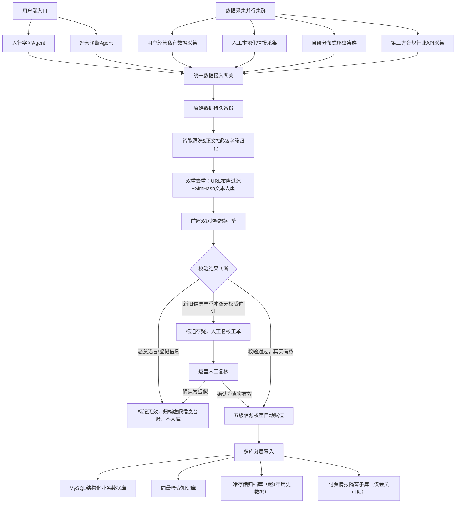
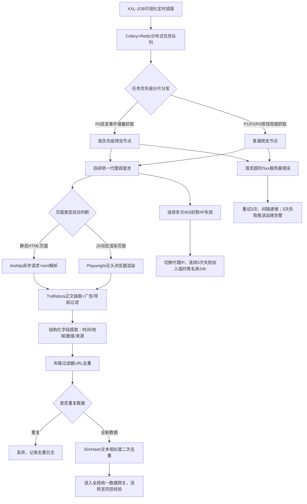
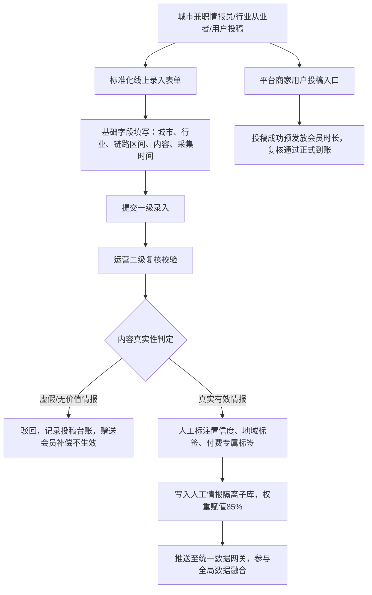
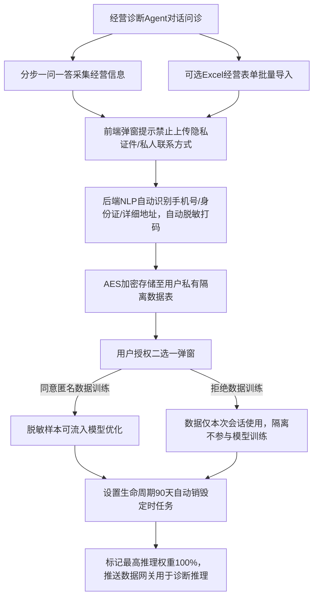
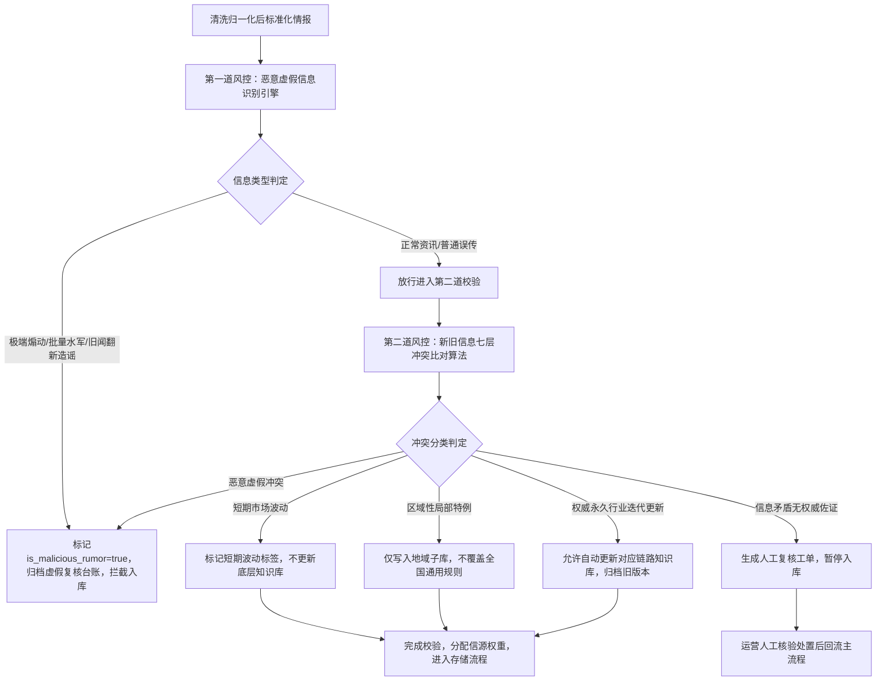
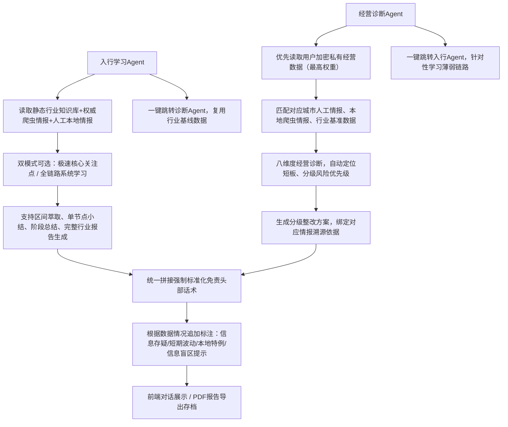

# BizSage 系统架构与技术框架

## 目录

- [第一部分：知识库主体框架](#第一部分知识库主体框架)
  - [1.1 知识库总体架构](#11-知识库总体架构)
  - [1.2 7 大行业全链路体系](#12-7-大行业全链路体系)
  - [1.3 技术栈选型依据](#13-技术栈选型依据)
- [第二部分：系统架构演进](#第二部分系统架构演进)
  - [2.1 V1.0 概念层架构（源自白皮书）](#21-v10-概念层架构源自白皮书)
  - [2.2 V4.0 全域架构](#22-v40-全域架构)
  - [2.3 核心架构决策记录](#23-核心架构决策记录)
- [第三部分：系统流程图](#第三部分系统流程图)
  - [3.1 数据采集流程](#31-数据采集流程)
  - [3.2 任务调度流程](#32-任务调度流程)
  - [3.3 数据去重流程](#33-数据去重流程)
  - [3.4 情报感知流程](#34-情报感知流程)
  - [3.5 诊断生成流程](#35-诊断生成流程)
- [源文档](#源文档)

---

## 第一部分：知识库主体框架

### 1.1 知识库总体架构

#### 产品核心定位（唯一核心差异点）

市面上普通行业知识库只存公开资料、定义、流程。BizSage 的核心差异化在于：

- **全产业链路结构化拆解**
- **显性标准流程**
- **行业隐形潜规则**
- **全节点量化指标**
- **大模型智能串联推理**

**目标**：让零基础用户 7 天吃透一个行业从原料到回款的完整商业运行逻辑，不仅懂"怎么做"，更懂"行业默认规则、赚钱节点、风控盲区、考核指标"。

**适用行业**：制造业、消费品、建材、汽车、医药、农产品、化工、本地服务业等有实体链路的垂直行业。

#### 六大核心产品模块

**模块 1：行业库总览（行业中枢首页）**

每个行业独立一套封闭链路体系，单行业结构统一，支持一键切换行业。

1. **行业基础画像**
   - 行业赛道分类、市场规模、上下游图谱、头部企业、准入门槛
   - 行业盈利模式、核心利润区、弱利润环节
2. **全链路可视化总图**
   - 一张图展示：原材料 -> 采购 -> 生产/加工 -> 品控 -> 仓储 -> 物流运输 -> 渠道运营 -> 销售终端 -> 售后复盘
   - 大模型支持：点击任意节点，自动展开详情、指标、潜规则、风险点、联动上下游节点

**模块 2：全链路结构化知识库（产品核心资产）**

固定 7 大标准链路节点（所有行业通用结构，保证标准化）：

1. 原料端体系
2. 生产制造体系
3. 品控质检体系
4. 仓储库存体系
5. 运输流通体系
6. 渠道运营体系
7. 销售交易 & 回款体系

每个节点统一 **五维数据结构**（核心独创架构）：

- **显性流程**：标准化官方流程、作业步骤、合规要求
- **量化指标**：行业通用 KPI、考核阈值、良率、损耗率、周转率、成本占比
- **隐形规则**：行业私下习惯、行规、回扣模式、合作潜规则、默认操作
- **风险痛点**：亏损点、坑点、合规红线、监管严查项
- **上下游联动**：该节点影响上游什么、制约下游什么

**模块 3：大模型智能解析引擎（产品核心能力）**

区别于普通文档问答，做行业链路推理：

1. **链路串联问答**
   - 支持提问："原材料涨价会传导到哪些环节？影响哪些指标？"
   - "制造业渠道潜规则会如何影响终端售价？"
   - "如何通过品控指标判断工厂盈利能力？"
2. **行业小白教学模式**
   - 大模型自动由浅入深讲解：总览 -> 单节点 -> 节点联动 -> 行业赚钱逻辑
3. **反向拆解模式**
   - 用户输入一个行业现象/结果，AI 反向推导全链路成因
4. **指标解释器**
   - 所有行业指标自动解释：计算公式、行业均值、优秀值、劣质值、优化方式

**模块 4：行业指标数据库（量化核心）**

全链路标准化指标库，所有指标可检索、可解释、可对比：

- 成本类指标
- 效率类指标
- 损耗类指标
- 周转类指标
- 销售转化指标
- 渠道运营指标
- 品控良率指标

**模块 5：行业潜规则专项库（独家壁垒）**

公开资料没有、行业老手才懂的隐性信息：

- 各环节灰色操作、默认让利、结算习惯
- 渠道压货潜规则、退换货行规
- 工厂代工猫腻、原料掺配惯例
- 物流报价隐形收费、行业包干规则
- 销售返点、渠道分层默认机制

**模块 6：个人学习 & 收藏体系**

- 行业学习路径（系统化学习路线）
- 节点收藏、指标收藏、潜规则收藏
- AI 生成个人行业笔记、思维导图
- 跨节点知识串联复盘

#### 产品最终呈现形态（前端交互结构）

1. **左侧**：行业目录（七大链路节点树状结构）
2. **中间**：节点详情（流程 + 指标 + 潜规则 + 风险）
3. **右侧**：AI 对话窗口（实时链路问答、推演、教学）
4. **顶部**：行业总览总图（可视化链路图谱，可点击穿透）
5. **悬浮层**：当前节点核心指标速览

#### 核心产品优势（产品壁垒）

1. **结构通用**：一套七层链路通吃所有实体行业，后续无限新增行业
2. **信息维度独家**：公开流程 + 量化指标 + 行业隐形潜规则三重叠加
3. **AI 不是闲聊**：是"行业链路推理引擎"，具备产业逻辑
4. **学习效率极高**：从原料到回款完整闭环，无知识断层
5. **商业实用性强**：直接看懂行业赚钱点、亏损点、灰色点、风险点

#### 开发迭代顺序

1. 先搭建七层全链路固定模板架构
2. 搭建指标库标准化字段体系
3. 搭建潜规则专属数据库字段
4. 接入大模型，开发链路串联推理能力
5. 可视化行业总图 + 节点穿透功能
6. 新增行业批量导入模板

---

### 1.2 7 大行业全链路体系

#### 1.2.1 各行业链路模型

以下为全行业通用底层结构，所有行业直接套用，无需重新设计结构。

##### 链路 1：原材料端（产业最上游）

**核心内容**：
1. 原料构成：核心原料、辅料、耗材、替代原料
2. 原料产地、供给格局、垄断情况、淡旺季
3. 原料采购流程：询价、比价、签约、账期、结算方式
4. 显性流程：采购合规、招标规则、入库标准
5. 隐形习惯：采购返点、定点供货潜规则、原料掺配惯例、淡旺季锁价行规
6. 核心指标：原料成本占比、采购溢价率、原料损耗率、供货准时率、库存周转天数

**上下游联动**：原料价格波动 -> 直接影响生产成本、出厂价、渠道利润空间

##### 链路 2：生产/制造/加工端（价值增值核心）

**核心内容**：
1. 完整生产线步骤、工序拆分、设备依赖
2. 产能结构：最大产能、常规产能、闲置产能、开机率
3. 用工体系、班次体系、代工/自产模式
4. 显性标准：生产 SOP、合规生产标准、安全标准
5. 隐形习惯：流水线偷工减料惯例、次品回流规则、代工猫腻、排单优先级潜规则
6. 核心指标：良品率、次品率、生产损耗率、单位能耗、人均产能、开机率、交付周期

**上下游联动**：生产良率 -> 决定品控通过率、退货率、终端口碑

##### 链路 3：品控质检端（质量筛选节点）

**核心内容**：
1. 初检、中检、出厂检、第三方检测流程
2. 不合格品处理机制：返工、报废、折价流出
3. 合规检测标准、资质门槛
4. 隐形习惯：抽检放水规则、批次混装惯例、瑕疵品流通潜规则
5. 核心指标：抽检合格率、批次不合格率、返工率、报废率、客诉质量占比

**上下游联动**：品控松紧 -> 直接影响售后成本、渠道退换货率

##### 链路 4：仓储库存端（中转沉淀节点）

**核心内容**：
1. 仓库分级：原料仓、半成品仓、成品仓
2. 入库、保管、盘点、出库流程
3. 库存安全水位、淡旺季备货策略
4. 隐形习惯：临期货品处理行规、库存积压甩货规则、串货库存潜规则
5. 核心指标：库存周转率、库损率、呆滞库存占比、备货准确率

**上下游联动**：库存积压 -> 压资金、倒逼渠道低价清货

##### 链路 5：物流运输流通端（空间流转节点）

**核心内容**：
1. 干线物流、同城配送、专线、整车/零担规则
2. 运费结构、报价体系、包干模式
3. 时效标准、破损赔付标准
4. 隐形习惯：物流报价隐形加价、破损免赔行规、凑单装车潜规则、渠道串货物流套路
5. 核心指标：物流成本占比、破损率、时效达标率、丢件率

**上下游联动**：物流成本波动 -> 影响终端零售价、渠道利润

##### 链路 6：渠道 & 运营体系（商业分发核心）

**核心内容**：
1. 渠道层级：总代理、分级代理、分销商、门店、电商
2. 层级加价规则、层级权责
3. 招商模式、扶持政策、压货机制
4. 隐形习惯：渠道返点、季度压货潜规则、区域保护与串货行规、调价默契
5. 核心指标：渠道动销率、压货率、层级毛利率、渠道流失率

**上下游联动**：渠道运营能力 -> 决定行业整体出货量、库存消化速度

##### 链路 7：销售 & 终端 & 回款体系（变现终点）

**核心内容**：
1. 终端销售场景、成交逻辑、定价体系
2. 促销规则、淡旺季销售策略
3. 回款账期、结算方式、欠款机制
4. 隐形习惯：终端议价潜规则、回款拖账行规、批量采购让利惯例、退换货默认规则
5. 核心指标：终端转化率、客单价、回款率、坏账率、销售毛利率

#### 1.2.2 知识分类体系

知识库采用 **双库物理隔离 + 三库分层存储** 架构：

**A. 双知识库物理隔离**

| 维度 | 静态行业基线知识库（权威基准库） | 动态实时情报知识库（时效业务库） |
|------|--------------------------------|--------------------------------|
| 存储内容 | 全行业产业链结构、经营准入规则、基础通用政策、行业经营常识、合规风险红线 | 最新政策公告、本地商圈变动、大宗商品行情、临时管控细则、区域性行业新规 |
| 更新机制 | 每日凌晨批量统一更新，人工审核准入，禁止实时随意写入 | 采集治理完成后实时增量入库 |
| 核心作用 | 大模型推理最低容错基准，约束模型输出，杜绝事实幻觉 | 保障诊断、行业分析具备当日时效性 |

**B. 三库分层存储架构**

1. **结构化知识库（MySQL）**：标准化行业指标、规则、参数，支持精准查询、经营量化测算、数据统计对比
2. **向量语义知识库（专用向量引擎）**：支撑自然语言模糊问答、语义联想、跨文本关联推理、行业科普
3. **时序版本知识库**：独立冷存储归档所有快照版本，用于政策迭代溯源、经营数据同比环比复盘

**C. 知识精炼 AI 引擎**

针对采集层碎片化、重复、高噪音原始情报做标准化提纯：
1. 自动合并同源、同主题重复知识点
2. 自动剔除过期、无价值碎片信息、广告软文
3. 统一标准化知识条目字段结构
4. 批量绑定行业、地域、时间、置信度标签
5. 输出适配大模型输入格式的高质量知识语料

**D. 完整知识生命周期管理**

新增原始情报 -> AI 精炼标准化 -> 分库入库 -> 生成时序快照 -> 热度动态更新 -> 低质信息自动降级 -> 过期数据归档/淘汰

---

### 1.3 技术栈选型依据

#### 后端核心框架

| 组件 | 技术选型 | 选型依据 |
|------|----------|----------|
| 任务调度 | XXL-JOB + Celery + Redis | XXL-JOB 提供可视化定时调度管理；Celery+Redis 构成分布式任务队列，支持优先级分片分发 |
| 爬虫框架 | Aiohttp + lxml / Playwright | Aiohttp 异步请求适用于静态 HTML 页面；Playwright 无头浏览器渲染适用于 JS 动态渲染页面 |
| 正文抽取 | Trafilatura | 高精度正文抽取能力，支持广告/导航过滤 |
| 结构化数据库 | MySQL | 存储结构化业务数据、行业指标、规则、参数 |
| 向量引擎 | 专用向量数据库 | 支撑语义模糊检索、自然语言问答、跨文本关联推理 |
| 缓存 | 多级 Redis 集群 | 数据缓存、分布式锁、任务队列 |
| 数据加密 | AES | 用户私有经营数据加密存储 |
| 隐私脱敏 | NLP 自动识别 | 自动识别手机号、身份证、详细地址并脱敏打码 |

#### 数据采集技术策略

| 维度 | 策略 |
|------|------|
| 政策采集 | 每日 2 次全量巡检 |
| 成本运价 | 4 小时增量抓取 |
| 市场资讯 | 每日 2 次 |
| 重大事件 | 自动升频 1 小时跟踪 7 天 |
| 代理调度 | 自研统一代理调度池 |
| 反爬处理 | 多厂商代理池，连续 403 自动切换 IP，5 次失败加入临时黑名单 24h |
| 请求异常 | 超时/5xx 重试 3 次（间隔递增），3 次失败推送运维告警 |

#### AI 推理技术策略

| 维度 | 策略 |
|------|------|
| 模型路由 | 轻量问答 -> 极速小模型；行业科普 -> 均衡通用模型；深度诊断 -> 高阶大模型；批量清洗 -> 专用任务小模型 |
| 校验闭环 | 五道校验：事实正确性、时效性、地域适配、逻辑自洽、合规风控 |
| 降级兜底 | 接口超时 -> 历史缓存；服务报错 -> 预置通用回答；算力满载 -> 排队限流 |

---

## 第二部分：系统架构演进

### 2.1 V1.0 概念层架构（源自白皮书）

#### 2.1.1 3 大 Agent 定义

系统定位：国内首个"静态行业知识库 + 用户一手经营数据 + 实时全网动态情报 + 真伪风控闭环 + 新旧冲突智能甄别 + 人工扫盲补盲"六维一体创业诊断 Agent 平台。

**Agent 方向 1：入行学习认知 Agent**

- 面向零基础创业者
- 教行业标准规则、链路、成本、行规、风险、机遇
- 核心能力：
  1. 行业全景认知讲解
  2. 各链路标准流程、标准成本、标准利润
  3. 行业通用行规、潜规则、避坑点
  4. 行业固定风险、固定机遇
  5. 行业准入资质、合规要求
  6. 最新动态情报同步展示
- 交互形态：对话式 Agent、行业报告生成、链路节点逐条讲解、风险机遇总览
- 数据来源：标准化行业静态知识库、后台情报引擎实时动态数据、人工本地化补充数据

**Agent 方向 2：经营诊断复盘 Agent**

- 面向在营商家
- 读取用户一手输入经营数据，做个性化诊断、短板定位、优先级整改、本地化适配
- 用户一手输入信息包含：门店情况、营收、成本、客流、渠道、供应商问题、库存、利润、当地经营困境、竞争情况、个人操作习惯
- 八大诊断维度：
  1. 本地市场适配度诊断
  2. 供应链成本诊断
  3. 库存与仓储诊断
  4. 渠道流量诊断
  5. 定价利润诊断
  6. 合规风险诊断
  7. 同行竞争差距诊断
  8. 短期机遇捕捉诊断
- 核心输出：
  1. 个性化经营短板清单
  2. 问题优先级排序（高/中/低危）
  3. 可落地整改步骤
  4. 结合本地实时政策 & 市场动态的时效性建议
  5. 最终经营诊断报告
- 独有机制：用户一手数据 > 动态情报 > 静态行业库（决策权重严格分层）

**Agent 方向 3：全网主动情报感知引擎（后端核心引擎）**

- 7x24 小时主动抓取、研判、更新行业政策、成本、热度、产能、渠道、监管动态
- 为双 Agent 提供实时动态数据

#### 2.1.2 NLP 引擎设计

**七层后端引擎架构**：

1. **多源采集调度层**：统一调度多数据源采集任务，管理抓取频率与优先级
2. **数据清洗标准化层**：字段归一化、正文抽取、去除噪音
3. **NLP 语义解析 & 链路关联层**：自动绑定行业、七大链路、地域、事件类型、影响周期、量化波动
4. **机遇/风险智能研判层**：四级风险机遇分级（1 级观察、2 级中性、3 级重要、4 级致命），自动生成全链路传导推演
5. **知识库同步存储层**：MySQL 结构化存储 + 向量库语义检索的双存储架构
6. **后台配置 & 复核 & 告警层**：数据源管理、关键词配置、情报复核、风险告警、地域筛选、日志审计、权限分级
7. **API 服务输出层**：情报查询、链路情报、重大事件置顶、语义检索、诊断联动情报 API

#### 2.1.3 多模块架构关系

**六维信息闭环**（竞品不具备）：

1. **静态行业标准知识库**（底层骨架）
2. **用户一手经营真实数据**（个性化依据）
3. **全网公开实时动态情报**（市场变量）
4. **人工本地化扫盲信息**（机器盲区补齐）
5. **付费圈层内幕情报**（高阶商业信息）
6. **真伪 + 新旧冲突智能风控体系**（防幻觉、防造谣、防过时）

**产品核心优势（终版总结）**：

- 全网唯一同时具备：静态教学 + 动态诊断 + 实时情报 + 真伪审核 + 新旧迭代 + 本地盲区补全
- 彻底解决 AI 通病：幻觉、过时、造谣误导、脱离本地、信息滞后、判断矛盾

**四大信息盲区与补全方案**：

| 盲区类型 | 解决方案 |
|----------|----------|
| 区域性信息盲区 | 省市县三级抓取 + 本地人工扫盲 + 地域子知识库隔离 |
| 即时突发信息盲区 | 事件触发式动态升频抓取、短时波动标记、实时热点跟踪 |
| 真实性不确定信息盲区 | 五级信源权重、交叉核验、孤证拦截、置信度标注 |
| 政府合规封锁信息盲区 | 完全不采集、不猜测、不推演，前台公示信息盲区，合法留白 |

**四层补盲体系**：

1. 技术自动补盲（公开信息）
2. 真人本地化扫盲（线下小众信息）
3. 付费专项情报（圈层内幕）
4. 法律红线避让（敏感封禁信息）

#### 大模型专属能力框架

**1. 链路推理能力（核心）**
- AI 可自动完成：
  - 上游变量 -> 中下游连锁反应推演
  - 单个指标变化 -> 全行业利润变化测算
  - 行业潜规则 -> 对合规、成本、销售的影响分析

**2. 行业通俗化翻译**
- 把国标术语、工业术语、渠道黑话、行规术语自动翻译成零基础可懂的商业逻辑

**3. 全局串联答疑**
- 用户任意提问，AI 不单独回答单点，而是串联整条链路解释
- 例："为什么这个行业利润薄？" -> AI 输出：原料端 + 生产端 + 物流 + 渠道 + 回款全链路利润拆分解释

**4. 行业模拟教学**
- AI 自动生成：
  - 行业入门学习大纲
  - 各环节易错点、坑点总结
  - 新手快速入行知识图谱

#### 恶意虚假信息拦截体系

**四大恶意信息识别**：
- 情绪煽动、批量水军搬运、旧闻翻新、同行恶意抹黑

**五层拦截闭环**：
1. 抓取源头黑名单拦截
2. NLP 恶意语义识别
3. 多源交叉核验（孤证不立）
4. 虚假信息权重降级、禁止触发风险机遇
5. 前台透明公示、免责话术

**运营台账 + AI 自迭代机制**：每日复核、谣言库自动更新、模型持续进化

#### 新旧信息差异冲突处理体系

**四大冲突分类**：
- 真实行业迭代、短期市场波动、区域性特例、恶意虚假冲突

**七层智能校验**：
- 时间权重、信源碾压、多源一致性、行业逻辑基线、地域隔离、临时/永久属性、历史趋势拟合

**最终处置规则**：
1. 权威新规 -> 自动更新知识库、归档旧版本
2. 短期波动 -> 仅展示、不固化
3. 局部信息 -> 仅更新地域子库、不覆盖全国规则
4. 虚假造谣 -> 直接拦截、拉黑、不参与推理

---

### 2.2 V4.0 全域架构

#### 2.2.1 9 大模块总览

**文档编号**：ARCH-V4.0-FULL

**适用角色**：产品、后端、爬虫、算法、前端、测试、运维、安全、商业化、项目交付

**核心设计目标**：高可用、高合规、技术壁垒强、商业化完整、易运维、支持弹性扩容、全链路可审计、故障自愈、多级降级兜底、支持灰度发布

**九层全域整体架构**：

1. **运维工程底座层**
   - 基础设施：多级 Redis 缓存集群、分布式任务调度、集群弹性伸缩、熔断/降级/死信队列机制
   - 容灾备份：异地双机房灾备、分层数据恢复方案、冷热数据分层存储、全链路数据血缘追溯
   - 环境管控：开发/测试/预发/生产四套环境物理隔离，禁止跨环境互通数据
   - 合规审计：全链路操作日志持久留存、隐私合规兜底、数据自动自愈机制
   - 运营管控：全链路资源成本管控、爬虫反爬安全攻防、系统 SLA 量化指标、自动化运维台账

2. **多源数据采集层**
   - 用户私有经营数据采集体系：对话分步采集、Excel 批量导入、隐私自动脱敏、AES 加密隔离、90 天自动销毁
   - 人工本地化情报采集体系：线下情报员/用户投稿、双人复核、地域 & 会员权限隔离、独家壁垒数据
   - 自研分布式合规爬虫集群：六层自研架构、增量抓取、分级重试、熔断降级、死信队列、多厂商代理池
   - 第三方合规 API 采集体系：多厂商冗余容灾、多级缓存、故障自动切换、时序快照兜底、计费用量管控

3. **全域数据治理层**
   - 基础处理：字段统一归一化、智能正文抽取、URL 布隆 + SimHash 双重去重、垃圾内容过滤
   - 双风控校验引擎：恶意谣言识别、新旧信息七层冲突比对，区分虚假/存疑/有效数据
   - 动态信源权重算法：替代固定静态权重，根据数据准确率、时效、冲突率自动动态调整权重
   - 时序版本快照体系：日/周/月/季度快照归档，用于趋势对比、历史回溯
   - 并发写入控制：知识库行级乐观锁，多源数据智能合并，避免内容覆盖错乱
   - 长期数据治理：字段级隐私脱敏、四层多租户数据物理隔离、定时自动清理无效垃圾数据

4. **智能知识中台层**
   - 双知识库物理隔离架构（静态行业基线知识库 + 动态实时情报知识库）
   - 三库分层存储（结构化 MySQL + 向量语义引擎 + 时序版本冷存储）
   - 知识精炼 AI 引擎（自动合并、去噪、标准化、标签绑定）
   - 完整知识生命周期管理（从采集到归档淘汰）

5. **多级 RAG 检索增强层**
   - 六维联动精准检索体系（关键词、向量语义、时序回溯、属地过滤、行业过滤、会员分级）
   - 智能重排序融合算法（六大权重维度）
   - 上下文自适应压缩优化
   - 防幻觉强制约束机制

6. **大模型推理服务层**
   - 多模型智能动态路由策略
   - 推理输出质量自检闭环（五道校验）
   - 全局标准化 Prompt 工程体系
   - 多级推理降级兜底机制

7. **双 Agent 智能业务核心层**
   - 入行学习 Agent（零基础用户教育体系）
   - 经营诊断 Agent（核心商业价值引擎）
   - Agent 三级记忆管理体系
   - Agent 统一输出强制规范

8. **商业化业务服务层**
   - 智能报告生成引擎（五类标准化报告）
   - 用户分层画像标签体系
   - RBAC 完整权限中台（双层隔离机制）
   - 会话管理中台
   - 用户意图识别与请求前置风控

9. **终端展示与输出层**
   - 对话交互前端终端（实时流式输出、结构化问答、情报溯源弹窗）
   - 文档输出终端（标准化 PDF 报告）
   - 后台管理运营终端（运维监控、情报审核、用户管理、告警中心、审计日志）
   - 移动端适配规范（自适应排版、轻量化资源、弱网降级）

#### 2.2.2 V1->V2->V3->V4 架构演进路线

| 版本 | 核心内容 | 关键补充 |
|------|----------|----------|
| V1.0 业务落地版 | 基础业务流程落地 | 仅覆盖数据采集基础流程 |
| V2.0 生产工程高可用版 | 生产工程高可用 | 补充爬虫容错、缓存、监控、基础合规规范 |
| V3.0 底层数据 & 运维闭环版 | 底层数据 & 运维终极闭环 | 补齐灾备、成本管控、数据血缘、冷热存储、安全攻防、SLA 验收标准、多环境隔离 |
| V4.0 全域封顶终版 | 全栈全域完整产品架构 | 完整补齐知识中台、RAG 检索、大模型推理、双 Agent 核心、商业化服务、网关安全、终端输出 |

V4.0 版本补齐第 4-9 层全部上层 AI、业务、终端架构，打通底层数据链路，形成端到端完整业务闭环。

#### 2.2.3 RAG 架构设计

**六维联动精准检索体系**：

所有检索自动匹配用户身份、权限、行业、地域，实现数据隔离过滤：

1. **关键词结构化精准检索**：匹配结构化数据库指标、规则
2. **向量语义模糊检索**：自然语言问答、模糊需求匹配
3. **时序历史回溯检索**：查询历史行情、旧版政策、过往经营数据
4. **用户属地地域过滤检索**：仅返回用户注册城市本地情报
5. **用户所属行业过滤检索**：屏蔽跨行业无关知识
6. **会员权限分级检索**：免费用户仅开放基础情报，高阶付费会员解锁圈层专属数据

**RAG 智能重排序融合算法**：

综合六大维度权重自动排序择优，淘汰低质量内容：
- 信源权威权重
- 内容时效权重
- 地域匹配权重
- 行业适配权重
- 人工复核置信权重
- 历史推理准确率权重

**上下文自适应压缩优化**：

1. 超长情报智能摘要，保留核心论据，剔除冗余描述
2. 多条相似知识自动合并去冗余
3. 根据当前模型上下文窗口大小动态调整返回内容长度

解决上下文溢出、推理耗时过长、token 资源浪费问题。

**RAG 防幻觉强制约束机制**：

1. 知识库无对应知识时，禁止主观编造结论，标注信息盲区
2. 信息存在冲突、模糊不清时，标记存疑，不单方面下定论
3. 所有推理论据强制绑定原始数据源、快照版本、发布时间

#### 2.2.4 Agent 框架设计

**整体定位**：

系统搭载两类垂直行业专用 Agent，场景完全区分、业务互补，覆盖全部用户需求。

**入行学习 Agent（知识科普型）**：

- 核心业务能力：
  1. 行业零基础分步入门教学
  2. 官方政策通俗拆解解读
  3. 经营规则、合规红线、潜在风险科普
  4. 实时行业动态、行情趋势解读推送
  5. 结构化、循序渐进的知识体系输出
- 标准工作链路：用户提问 -> 意图识别分类 -> 六维 RAG 多源检索 -> 知识精炼压缩 -> 通俗化语言重构 -> 结构化内容输出展示

**经营诊断 Agent（核心商业价值引擎）**：

- 核心业务能力：
  1. 八维度经营全景体检诊断
  2. 经营短板精准定位、根因分析
  3. 成本、利润量化测算，收益趋势预判
  4. 本地同商圈同行经营对标分析
  5. 行业风险、经营机遇挖掘
  6. 定制化落地整改方案、分步执行规划
  7. 短期经营调整、中长期发展策略生成

- **专属加权推理规则（平台独家设计）**：

| 数据源 | 推理权重 |
|--------|----------|
| 用户私有经营数据 | 100%（最高优先级） |
| 本地人工线下商圈情报 | 85% |
| 权威公开爬虫情报 | 60% |
| 静态行业基线知识库 | 兜底基准 |

融合计算，生成千人千面个性化诊断结果。

**Agent 三级记忆管理体系**：

1. **短期会话记忆**：维持单轮对话上下文连贯，不割裂对话逻辑
2. **长期用户画像记忆**：固化用户行业、城市、经营规模、历史咨询痛点、偏好
3. **智能自动遗忘机制**：90 天无调用的无效记忆自动精简，避免冗余数据干扰推理

**Agent 统一输出强制规范**：

所有对话输出内容必须附带四项标准化信息：原始数据来源溯源、信息生效时效、内容置信度等级、标准化合规免责声明。

#### 2.2.5 Prompt 工程体系

**全局标准化 Prompt 工程体系**：

统一封装固定推理底座，全平台推理输出风格、格式统一：

| Prompt 类型 | 功能说明 |
|-------------|----------|
| 角色定位 Prompt | 定义 AI 角色身份与回答基调 |
| 行业专属 Prompt | 绑定特定行业知识库上下文 |
| 地域适配 Prompt | 适配用户所在城市区域规则 |
| 合规风控 Prompt | 强制输出合规、免责、不越界 |
| 结构化输出 Prompt | 保证输出格式统一、分段清晰 |
| 溯源免责 Prompt | 强制附带来源、时效、置信度、免责声明 |

**推理输出质量自检闭环（双层校验）**：

模型生成内容后自动执行五道校验，校验不通过则重新发起推理：
1. 事实正确性校验：与静态行业基线知识库比对，杜绝错误常识
2. 时效性校验：过滤过期失效政策、过时行情数据
3. 地域适配校验：剔除跨城市、跨区域不适用规则
4. 逻辑自洽校验：保证前后分析结论无矛盾冲突
5. 合规风控校验：过滤夸大宣传、煽动性、违规风险话术

**多级推理降级兜底机制**：
1. 模型接口超时：读取历史缓存结果兜底响应
2. 模型服务报错：预置标准通用回答兜底
3. 集群算力满载：请求排队限流，前端展示友好等待提示

---

### 2.3 核心架构决策记录

#### 双库物理隔离决策

**决策**：静态行业基线知识库与动态实时情报知识库物理隔离。

**依据**：
- 静态库作为最低容错基准，约束模型输出，杜绝事实幻觉
- 动态库保障当日时效性，适配实时市场变化
- 静态库每日批量更新+人工审核；动态库实时增量入库
- 避免实时随意写入污染基线知识

#### 四级风险机遇分级决策

**决策**：情报研判结果分为 1 级观察、2 级中性、3 级重要、4 级致命。

**依据**：
- 分级自动触发全链路传导推演
- 差异化影响后续 Agent 推理权重
- 运营后台可按级设置告警阈值

#### 用户数据最高权重决策

**决策**：用户私有经营数据推理权重 100%（最高优先级），高于其他所有数据源。

**依据**：
- 保证诊断结果贴合用户真实现状
- 避免通用化、模板化输出
- 数据全程 AES 加密、物理隔离、90 天自动销毁

#### 信源权重动态化决策

**决策**：动态信源权重算法替代固定静态权重。

**依据**：
- 根据数据准确率、时效、冲突率自动动态调整
- 避免过时或低质信源长期占据高权重
- 持续优化推理质量

#### 防幻觉强制约束决策

**决策**：RAG 检索 + 输出校验双闭环强制约束。

**依据**：
- 知识库无对应知识时禁止编造
- 信息冲突时标记存疑不下定论
- 所有论据强制绑定原始数据源与发布时间

#### 全局标准化 Prompt 决策

**决策**：统一封装六类固定 Prompt。

**依据**：
- 保证全平台推理输出风格一致
- 角色、行业、地域、合规、格式、溯源全覆盖
- 支撑多模型智能路由的无缝切换

---

## 第三部分：系统流程图

### 3.1 数据采集流程

### 3.2 任务调度流程

### 3.3 数据去重流程

**用户私有数据采集子流程**：

### 3.4 情报感知流程

### 3.5 诊断生成流程

---

## 源文档

本文档由以下源文档合并编写：

1. `大模型行业全链路知识库软件｜主体框架+行业全链路体系框架（可直接开发落地）.pdf`
2. `行业智能创业Agent平台·终极完整版全系统设计白皮书（全模块闭环·可直接开发）.pdf`
3. `行业智能创业Agent平台全域完整架构设计文档（V4.0_全域封顶终版）.pdf`
4. `行业智能创业Agent平台_全系统完整流程图（文本结构化流程图，可直接复制到Visio_ProcessOn_PlantUML绘图）.pdf`
